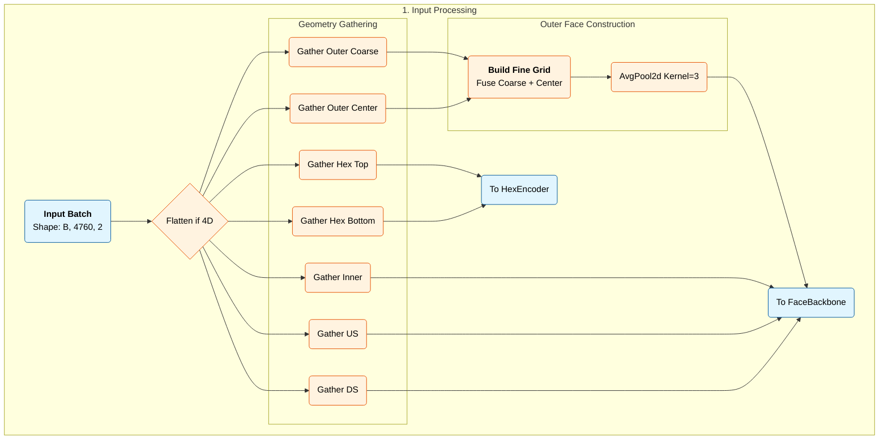
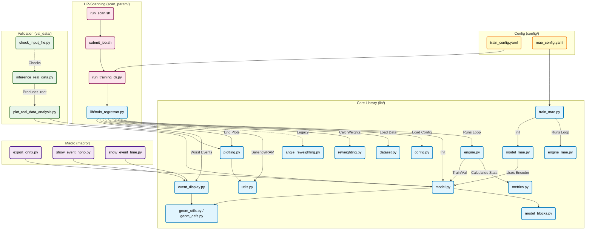

# xec-ml-wl

## Machine Learning Model for the MEG II Liquid Xenon (LXe) Detector

This repository contains machine learning model (CNN + Graph Transformer) to regress physical observables including emission angle (**$\theta$**, **$\phi$**), energy, timing, and position (**uvwFI**) from photons detected by the LXe detector, utilizing both photon count (**$N_{\mathrm{pho}}$**) and timing information (**$t_{\mathrm{pm}}$**) in each photo-sensor (4092 SiPMs and 668 PMTs).

This model respects the complex topology of the detector by combining:
1.  **ConvNeXt V2** for rectangular faces (Inner, Outer, US, DS).
2.  **HexNeXt (Graph Attention)** for hexagonal PMT faces (Top, Bottom).
3.  **Transformer Fusion** to correlate signals across disjoint detector faces.

---

## 1. Environment Setup

The repository supports both **x86 (A100)** and **ARM (Grace-Hopper)** architectures on the Merlin7 cluster. Due to binary incompatibility, I have prepared **two separate environments**.

### First-Time Setup

### 1. A100 Nodes (a100-* partition)

These x86-based nodes use the system Anaconda module:

```bash
$ module load anaconda/2024.08
$ conda env create -f env_setting/xec-ml-wl-gpu.yml

# To update
$ conda env update -f env_setting/xec-ml-wl-gpu.yml --prune

# When changing the python version
$ conda env remove -n xec-ml-wl
$ conda env create -f xec-ml-wl-gpu.yml
```

### 2. Grace-Hopper Nodes (gh-* partition)

These ARM64-based nodes require a custom Miniforge installation.

#### Log in to a GH node:

```bash
$ srun --cluster=gmerlin7 --partition=gh-interactive --gres=gpu:1 --mem=40GB --pty /bin/bash
```

#### Install Miniforge:

```bash
$ wget https://github.com/conda-forge/miniforge/releases/latest/download/Miniforge3-Linux-aarch64.sh

$ bash Miniforge3-Linux-aarch64.sh -b -p $HOME/miniforge-arm
```

#### Create Environment:

```bash
# 1. Prepare the environment
$ source $HOME/miniforge-arm/bin/activate

# 2. Create base with system libs
$ mamba create -n xec-ml-wl-gh python=3.10 numpy scipy pandas matplotlib scikit-learn \
    tqdm pyarrow pyyaml jupyterlab ipykernel uproot awkward vector \
    pytorch-lightning torchmetrics tensorboard onnx mlflow \
    -c conda-forge -y

# 3. Activate
$ conda activate xec-ml-wl-gh

# 4. Install PyTorch (GPU)
$ pip install torch torchvision torchaudio --index-url https://download.pytorch.org/whl/cu124

# 5. Install ONNX Runtime GPU (optional)
$ pip install onnxruntime-gpu
```

#### Update Environment:

```bash
(Assumes already logged into GH node)
# 1. Prepare the environment
$ source $HOME/miniforge-arm/bin/activate
$ mamba env remove -n xec-ml-wl-gh # <- recreating env when changing python version
(optional) $ mamba clean -a -y # Clear cache to free space/remove corrupt tarballs

# 2. Create base environment
mamba create -n xec-ml-wl-gh python=3.12 \
    numpy scipy pandas matplotlib scikit-learn \
    tqdm pyarrow pyyaml jupyterlab ipykernel \
    uproot awkward vector \
    pytorch-lightning=2.4.0 torchmetrics=1.5.0 tensorboard \
    onnx=1.17.0 mlflow \
    -c conda-forge -y

# 3. Activate
$ conda activate xec-ml-wl-gh

# 5. Install PyTorch (GPU)
$ pip install --upgrade pip
$ pip install torch==2.5.1 torchvision==0.20.1 torchaudio==2.5.1 --index-url https://download.pytorch.org/whl/cu124

# 6. Install PyG (skip this if PyG packages are not used in Hex face)
$ pip install torch-scatter torch-sparse torch-cluster torch-spline-conv torch-geometric

# 7. Install ONNX Runtime GPU and others
$ pip install pytorch-lightning==2.4.0 torchmetrics==1.5.0 onnx==1.17.0 onnxruntime

# 8. Verification
$ python -c "import torch; print(f'PyTorch: {torch.__version__}'); print(f'CUDA: {torch.version.cuda}'); print(f'GPU: {torch.cuda.get_device_name(0)}')"
# -> Expected PyTorch: 2.5.1, CUDA: 12.4, GPU: NVIDIA GH200 120GB

```

### 3. Prepare Batch Job

```bash
$ chmod +x start_jupyter_xec_gpu.sh submit_job.sh run_scan.sh
```

---

## 2. Usage

### A. Batch Training

We use `submit_job.sh`, which automatically detects the CPU architecture of the allocated node and activates the correct environment (x86 or ARM). Training is now **config-based** using YAML files.

#### 1. Quick Submission

```bash
# Usage:
# ./submit_job.sh [RUN_NAME] [CONFIG_FILE] [PARTITION] [TIME]
$ cd scan_param
$ ./submit_job.sh test_run_01 ../config/train_config.yaml a100-daily 12:00:00
```

#### 2. Config + CLI Overrides

Override specific parameters via environment variables:

```bash
# Override epochs and learning rate
$ EPOCHS=100 LR=1e-4 ./submit_job.sh my_run ../config/train_config.yaml a100-daily 12:00:00

# Enable multiple tasks
$ TASKS="angle energy" ./submit_job.sh multi_task_run ../config/train_config.yaml a100-daily 12:00:00
```

#### 3. Direct Python Training

```bash
# Config-based training
$ python -m lib.train_regressor --config config/train_config.yaml

# CLI with config file
$ python scan_param/run_training_cli.py --config config/train_config.yaml --train_path /path/train --val_path /path/val
```

#### 4. Optimization Best Practices

For GH nodes, use the following settings to maximize throughput:
* **Batch Size**: 16384 (Uses ~65GB VRAM, ~70% capacity)
* **Chunk Size**: 524880 (320 Batches)
* **Memory**: Normally uses 5-10GB RAM

### B. Interactive Jupyter Session

```bash
# Syntax:
# ./start_jupyter_xec_gpu.sh [PARTITION] [TIME] [PORT]
./start_jupyter_xec_gpu.sh gh-interactive 02:00:00 8888
```
1. Wait for the connection URL.
2. Tunnel ports locally: `ssh -N -L 8888:localhost:8888 -J <user>@login001 <user>@gpuXXX`
3. Paste the URL with token in the browser.

### C. Masked Autoencoder (MAE) Pre-training

The library supports self-supervised pre-training using a Masked Autoencoder (MAE) approach. This allows the model to learn geometric features from the raw detector data without requiring ground-truth labels.

#### 0. Simple run (mainly for check)

Pretrain the encoder with a masked autoencoder and save the encoder weights for later regression runs (use `--resume_from` in training).

```bash
# CLI mode (legacy)
python -m lib.train_mae --train_root /path/to/data.root --save_path mae_pretrained.pth --epochs 20 --batch_size 1024

# Finegrid outer face (optional)
python -m lib.train_mae --train_root /path/to/data.root --save_path mae_pretrained.pth --epochs 20 --batch_size 1024 \
  --outer_mode finegrid --outer_fine_pool 3 3

# Config mode (recommended)
python -m lib.train_mae --config config/mae_config.yaml

# Config + CLI override
python -m lib.train_mae --config config/mae_config.yaml --epochs 50 --train_root /path/to/train
```

#### 1. Running Pre-training

Dedicated scripts are under `scan_param/` to streamline the MAE workflow.

1. Configure the Run: Edit `scan_param/run_mae.sh` to set desired parameters:

    - `ROOT_PATH`: Path to the dataset (wildcards supported)
    - `EPOCHS`: Number of pre-training epochs
    - `MASK_RATIO`: Percentage of sensors to mask (default `0.75`)
    - `BATCH`: Batch size

2. Submit the Job:

    ```bash
    cd scan_param
    ./run_mae.sh
    ```
    This submits a SLURM job using `submit_mae.sh`

3. Output: Checkpoints will be saved to `~/meghome/xec-ml-wl/artifacts/<RUN_NAME>/`. The weights file is typically named `mae_checkpoint.pth`

#### 2. Fine-Tuning for Regression

Once pre-training is complete, one can load the learned encoder weights into the regression model for fine-tuning.

1. **Configure Regression**: Edit `scan_param/run_scan.sh`.
2. **Set Resume Path**: Point the `RESUME_FRPM` variable to your MAE checkpoint:
    ```bash
    RESUME_FROM="$HOME/meghome/xec-ml-wl/artifacts/<RUN_NAME>/<CHECKPOINT_NAME>.pth"
    ```
3. **Run Regression**: Submit the training job as usual:
    ```bash
    ./run_scan.sh
    ```

**Note on Weight Loading**: The training script (`lib/train_regressor.py`) automatically detects the type of checkpoint provided:

- **Full checkpoint**: If resuming a regression run, it loads the optimizer state, epoch, and full model to continue exactly where it left off.
- **MAE Weights**: If loading an MAE file, it detects "raw weights", loads only the encoder (skipping the regression head), initiallize the EMA model correctly, and resets the epoch counter to 1 for fresh fine-tuning

### D. Multi-Task Learning

The model supports simultaneous regression of multiple physical observables. Configure tasks in `config/train_config.yaml`:

```yaml
tasks:
  angle:
    enabled: true
    loss_fn: "smooth_l1"    # smooth_l1, l1, mse, huber
    loss_beta: 1.0
    weight: 1.0
  energy:
    enabled: false
    loss_fn: "l1"
    weight: 1.0
  timing:
    enabled: false
    loss_fn: "l1"
    weight: 1.0
  uvwFI:
    enabled: false
    loss_fn: "mse"
    weight: 1.0
```

**Models:**
- `XECEncoder`: Single-task (angle-only, legacy)
- `XECMultiHeadModel`: Multi-task with shared backbone and task-specific heads

**Task Output Dimensions:**
| Task | Output | Description |
|------|--------|-------------|
| `angle` | 2 | (θ, φ) emission angles |
| `energy` | 1 | Energy |
| `timing` | 1 | Timing |
| `uvwFI` | 3 | (u, v, w) position coordinates |

**Experimental Heads** (available but not fully tested):
| Task | Output | Description |
|------|--------|-------------|
| `angleVec` | 3 | Emission direction unit vector (x, y, z) |
| `n_gamma` | 5 | Number of gammas classification (0-4) |

### E. Sample Reweighting

Balance training distributions using histogram-based reweighting. This helps when certain regions (e.g., specific angles or energies) are underrepresented in training data.

Configure in `config/train_config.yaml`:

```yaml
reweighting:
  angle:
    enabled: true
    nbins_2d: [20, 20]    # (theta_bins, phi_bins)
  energy:
    enabled: false
    nbins: 30
  timing:
    enabled: false
    nbins: 30
  uvwFI:
    enabled: false
    nbins_2d: [10, 10]    # (u_bins, v_bins) - uses same for w
```

The `SampleReweighter` class (`lib/reweighting.py`) fits histograms on training data and computes per-sample weights to balance underrepresented regions during training.

### F. Data Format

ROOT files with TTree structure. Default tree name: `tree`.

**Input Branches** (shape: 4760 per event):
| Branch | Description |
|--------|-------------|
| `relative_npho` | Normalized photon counts per sensor |
| `relative_time` | Normalized timing per sensor |

**Truth Branches:**
| Branch | Shape | Description |
|--------|-------|-------------|
| `emiAng` | (2,) | Emission angle (θ, φ) in radians |
| `energyTruth` | (1,) | True gamma energy |
| `timeTruth` | (1,) | True gamma timing |
| `uvwTruth` | (3,) | First interaction position (u, v, w) |
| `xyzTruth` | (3,) | First interaction position (x, y, z) |
| `emiVec` | (3,) | Emission direction unit vector |
| `xyzVTX` | (3,) | Vertex position (gamma origin) |
| `run` | (1,) | Run number |
| `event` | (1,) | Event number |

**Preprocessing:**
- Npho values are scaled by `npho_scale` (default: 0.58) and `npho_scale2` (default: 1.0)
- Time values are scaled by `time_scale` (default: 6.5e-8) and shifted by `time_shift` (default: 0.5)
- Bad/missing channels are marked with `sentinel_value` (default: -5.0)

---

## 3. Output & Artifacts

All results are logged to **MLflow** and stored in the `artifacts/<RUN_NAME>/` directory.

### Key Artifacts

* `checkpoint_best.pth` — Best model weights (includes EMA state).
* `checkpoint_last.pth` — Last epoch's model weights (includes EMA state).
* `predictions_*.csv` — Validation predictions vs truth.
* `*.onnx` — Exported ONNX model for C++ inference (supports single-task and multi-task).
* `validation_results_*.root` — ROOT file containing event-by-event predictions and truth variables.

### Plots

* `resolution_profile_*.pdf`: 68% width resolution vs $\theta$/$\phi$.
* `saliency_profile_*.pdf`: Physics Sensitivity analysis (Gradient of output w.r.t input Npho/Time).
* `worst_event_*.pdf`: Event displays of the highest-loss events.
* `saliency_profile_*.pdf`: Computes $\nabla_{\text{Input}} \text{Output}$ to quantify how much the model relies on Photon Counts vs Timing for each face (Inner, Top, Hex, etc.) to determine $\theta$ and $\phi$.

### Visualization Tools

The real time tracking of the training is available with MLflow and TensorBoard.
```bash
# Start MLflow (Track metrics & PDFs)
$ cd /path/to/xec-ml-wl
$ (activate xec-ml-wl conda environment)
$ mlflow ui --backend-store-uri sqlite:///$(pwd)/mlruns.db --host 127.0.0.1 --port 5000

# Start TensorBoard (Track Loss Curves)
$ tensorboard --logdir runs --host 0.0.0.0 --port YYYY
```

### Metrics Definition

#### 1. Physics Performance Metrics

These metrics evaluate the quality of the photon direction reconstruction. They are calculated during the validation phase using `eval_stats` and `eval_resolution`.

| Metric | Definition | Formula |
| ------ | ---------- | ------- | 
| Theta Bias (`theta_bias`) | The arithmetic mean of the residuals. | $\mu = \text{Mean}(\theta_{\mathrm{pred}} - \theta_{\mathrm{true}})$ |
| Theta RMS (`theta_rms`) | The standard deviation of the residuals. | $\sigma = \text{Std}(\theta_{\mathrm{pred}} - \theta_{\mathrm{true}})$ |
| Theta Skewness (`theta_skew`) | A measure of the asymmetry of the error distribution. | $$\text{Skew} = \frac{\frac{1}{N} \sum_{i=1}^{N} (\Delta \theta_i - \mu)^3}{\left( \frac{1}{N} \sum_{i=1}^{N} (\Delta \theta_i - \mu)^2 \right)^{3/2}}$$ |
| Opening Angle Resolution (`val_resolution_deg`) | The 68th percentile of the 3D opening angle $\psi$ between the predicted and true vectors. | $\psi = \arccos(v_{\mathrm{pred}} \cdot v_{\mathrm{true}})$ |

#### 2. System Engineering Metrics
These metrics monitor the health of the training infrastructure (GPU/CPU) to detect bottlenecks or imminent crashes.

| Metric           | Key in MLflow                    | Interpretation                                                                            |
| ---------------- | -------------------------------- | --------------------------------- |
| Allocated Memory | `system/` `memory_allocated_GB`  | The actual size of tensors (weights, gradients, data) on the GPU. Steady growth indicates a memory leak.Reserved Memorysystem/memory_reserved_GBThe total memory PyTorch has requested from the OS. If this hits the hardware limit, an OOM crash occurs.                                                      |
| Peak Memory      | `system/` `memory_peak_GB`       | The highest memory usage recorded (usually during the backward pass). Use this to tune batch_size.                          |
| GPU Utilization  | `system/` `gpu_utilization_pct`  | Ratio of Allocated to Total VRAM. Low values (<50%) suggest the batch size can be increased; very high values (>90%) risk OOM.  |
| Fragmentation    | `system/` `memory_fragmentation` | Ratio of empty space within reserved memory blocks. High fragmentation (>0.5) indicates inefficient memory use.                | 
| RAM Usage        | `system/` `ram_used_gb`          | System RAM used by the process. High usage warns that step_size for ROOT file reading is too large.                            | 
| Throughput       | `system/` `epoch_duration_sec`   | Wall-clock time per epoch. If high while GPU utilization is low, the pipeline is CPU-bound (data loading bottleneck).        |

#### 3. System Performance Metrics
These metrics determine if the training pipeline is efficient or bottlenecked.
| Metric             | Key in MLflow                      | Definition & goal                 |
| ------------------ | ---------------------------------- | --------------------------------- |
| Throughput         | `system/throughput_events_per_sec` | Events processed per second.      |
| Data Load Time     | `system/avg_data_load_sec`         | Time GPU waits for CPU. If high, increase CHUNK_SIZE. |
| Compute Efficiency | `system/compute_efficiency`        | % of time GPU is computing.       |

---

## 4. Model Architecture

The model (`XECEncoder`) utilizes a multi-branch architecture to handle the heterogeneous sensor geometry (SiPMs vs PMTs), followed by an attention-based fusion mechanism.

### A. The Pipeline

```mermaid
graph TD
    %% -- Styles --
    classDef tensor fill:#e1f5fe,stroke:#01579b,stroke-width:1px,color:#000000;
    classDef op fill:#fff3e0,stroke:#e65100,stroke-width:1px,color:#000000;
    classDef block fill:#e8f5e9,stroke:#1b5e20,stroke-width:2px,color:#000000;
    classDef fusion fill:#f3e5f5,stroke:#4a148c,stroke-width:2px,color:#000000;
    classDef param fill:#fff9c4,stroke:#fbc02d,stroke-dasharray: 5 5,color:#000000;

    %% ==========================================
    %% 2. CNN BACKBONE (SHARED)
    %% ==========================================
    subgraph "2. ConvNeXt V2 Path"
        FaceIn(Face Input):::tensor

        %% Stem
        subgraph "Stem"
            StemConv("Conv2d 2->32<br/>k=4, s=1, p=1"):::op
            StemLN(LayerNorm):::op
        end

        %% Stage 1
        subgraph "Stage 1 (Dim=32)"
            CNBlock1("<b>ConvNeXtV2 Block 1</b><br/>DWConv k=7 -> LN -> PWLinear -> GELU -> GRN -> PWLinear"):::block
            CNBlock2("<b>ConvNeXtV2 Block 2</b><br/>DWConv k=7 -> LN -> PWLinear -> GELU -> GRN -> PWLinear"):::block
        end
        
        %% Downsample
        subgraph "Downsample"
            DS_LN(LayerNorm):::op
            DS_Conv("Conv2d 32->64<br/>k=2, s=2"):::op
        end

        %% Stage 2
        subgraph "Stage 2 (Dim=64)"
            CNBlock3(<b>ConvNeXtV2 Block 1</b>):::block
            CNBlock4(<b>ConvNeXtV2 Block 2</b>):::block
            CNBlock5(<b>ConvNeXtV2 Block 3</b>):::block
        end

        %% Output
        Interp(Interpolate to 4x4):::op
        FlatCNN(Flatten):::op
        FaceOut("<b>Face Token</b><br/>Dim: 1024"):::tensor
    end

    %% ==========================================
    %% 3. HEX ENCODER (SHARED)
    %% ==========================================
    subgraph "3. GraphAttention Path"
        HexIn(Hex Nodes):::tensor
        
        %% Stem
        subgraph "Hex Stem"
            HexStemLin(Linear 2->96):::op
            HexStemLN(LayerNorm):::op
            HexStemAct(GELU):::op
        end
        
        %% HexNeXt Stack
        subgraph "HexNeXt Stack (4 Layers)"
            HNBlock1("<b>HexNeXt Block 1</b><br/>HexDepthwise -> LN -> Linear -> GELU -> GRN -> Linear"):::block
            HNBlock2(<b>HexNeXt Block 2</b>):::block
            HNBlock3(<b>HexNeXt Block 3</b>):::block
            HNBlock4(<b>HexNeXt Block 4</b>):::block
        end
        
        %% Pooling
        HexPool(Global Mean Pool):::op
        
        %% Projection
        subgraph "Projection"
            HexProjLN(LayerNorm):::op
            HexProjLin(Linear 96->1024):::op
        end
        
        HexOut("<b>Hex Token</b><br/>Dim: 1024"):::tensor
    end

    %% ==========================================
    %% 4. FUSION & HEAD
    %% ==========================================
    subgraph "4. Fusion & Regression (XECEncoder)"
        TokenStack("<b>Stack Tokens</b><br/>[Inner, US, DS, Outer, Top, Bot]<br/>Shape: (B, 6, 1024)"):::op
        PosEmbed(Add Pos Embed):::op
        
        subgraph "Transformer Encoder (Dim=1024)"
            TransL1("<b>Layer 1</b><br/>SelfAttn 8-Head -> Add&Norm -> FeedForward 4096 -> Add&Norm"):::fusion
            TransL2("<b>Layer 2</b><br/>SelfAttn 8-Head -> Add&Norm -> FeedForward 4096 -> Add&Norm"):::fusion
        end
        
        FlatAll("<b>Flatten Sequence</b><br/>Dim: 6 * 1024 = 6144"):::op
        
        subgraph "Regression Head"
            HeadLin1(Linear 6144 -> 256):::op
            HeadLN(LayerNorm):::op
            HeadGELU(GELU):::op
            HeadDrop(Dropout 0.2):::op
            HeadLin2(Linear 256 -> 2):::op
        end
        
        FinalOut(("<b>Output</b><br/>Theta, Phi")):::tensor
    end

    %% ==========================================
    %% CONNECTIONS
    %% ==========================================
    
    %% CNN Flow
    FaceIn --> StemConv --> StemLN --> CNBlock1
    CNBlock1 --> CNBlock2 --> DS_LN --> DS_Conv
    DS_Conv --> CNBlock3 --> CNBlock4 --> CNBlock5
    CNBlock5 --> Interp --> FlatCNN --> FaceOut
    
    %% Hex Flow
    HexIn --> HexStemLin --> HexStemLN --> HexStemAct
    HexStemAct --> HNBlock1 --> HNBlock2 --> HNBlock3 --> HNBlock4
    HNBlock4 --> HexPool --> HexProjLN --> HexProjLin --> HexOut
    
    %% Fusion Flow
    FaceOut --> TokenStack
    HexOut --> TokenStack
    TokenStack --> PosEmbed --> TransL1 --> TransL2
    TransL2 --> FlatAll --> HeadLin1 --> HeadLN --> HeadGELU --> HeadDrop --> HeadLin2 --> FinalOut
```




### B. Key Components

#### 1. Rectangular Branch: ConvNeXt V2
* **Faces**: Inner, Outer (Fine Grid), Upstream, Downstream.
* **Architecture**: Uses ConvNeXt V2 blocks with Global Response Normalization (GRN) to prevent feature collapse in sparse photon data.
* **Pooling**: Output feature maps are standardized to a $4 \times 4$ grid using Bilinear Interpolation to preserve spatial variance within the face.

#### 2. Hexagonal Branch: Deep HexNeXt
* **Faces**: Top, Bottom (Hexagonal Lattice).
* **Problem**: Standard GCNs (isotropic) cannot easily detect "directionality" (gradients) in a single layer.
* **Solution**: Introduce the HexNeXt Block, a custom Graph Attention (GAT) layer.It learns dynamic attention weights between neighbors (anisotropy), effectively creating a "directional kernel" on the hex grid.
* **Structure**: Stem -> [HexDepthwiseConv -> LayerNorm -> PWConv -> GRN -> PWConv] x4.3. 

#### 3. Mid-Fusion: Transformer Encoder
* **Problem**: Physics events (showers) often cross boundaries (e.g., Corner events). Independent CNNs struggle to "stitch" these images together.
* **Solution**: We treat each detector face as a Token in a sequence.
* **Positional Embeddings**: Learnable vectors are added to each token so the model knows which face is where.
* **Self-Attention**: A 2-layer Transformer Encoder allows every face to "talk" to every other face globally before the final prediction.

### C. Training Features
* **EMA (Exponential Moving Average)**: Maintains a shadow model ($W_{\mathrm{ema}} = \beta W_{\mathrm{ema}} + (1-\beta)W_{\mathrm{live}}$) for stable validation.
* **Positional Encoding**: Essential for the Transformer to understand the detector topology.

### D. References
1. ConvNeXt V2: Woo, S., et al. "ConvNeXt V2: Co-designing and Scaling ConvNets with Masked Autoencoders." CVPR 2023.
2. Graph Attention (GAT): Veličković, P., et al. "Graph Attention Networks." ICLR 2018.
3. Transformer: Vaswani, A., et al. "Attention Is All You Need." NeurIPS 2017.

### Configuration Parameters

Training is now **config-based** using `config/train_config.yaml`. CLI arguments can override config values.

| Parameter | Config Path | Default | Description |
|-----------|-------------|---------|-------------|
| `--train_path` | `data.train_path` | Required | Path to training ROOT file(s) |
| `--val_path` | `data.val_path` | Required | Path to validation ROOT file(s) |
| `--batch` | `data.batch_size` | `256` | Batch size |
| `--chunksize` | `data.chunksize` | `256000` | Events per ROOT read |
| `--epochs` | `training.epochs` | `20` | Training epochs |
| `--lr` | `training.lr` | `3e-4` | Learning rate |
| `--weight_decay` | `training.weight_decay` | `1e-4` | Weight decay |
| `--warmup_epochs` | `training.warmup_epochs` | `2` | Warmup epochs |
| `--ema_decay` | `training.ema_decay` | `0.999` | EMA decay rate |
| `--grad_clip` | `training.grad_clip` | `1.0` | Gradient clipping |
| `--npho_scale` | `normalization.npho_scale` | `0.58` | Photon count normalization |
| `--npho_scale2` | `normalization.npho_scale2` | `1.0` | Secondary npho normalization |
| `--time_scale` | `normalization.time_scale` | `6.5e-8` | Time normalization |
| `--time_shift` | `normalization.time_shift` | `0.5` | Time offset shift |
| `--sentinel_value` | `normalization.sentinel_value` | `-5.0` | Bad channel marker |
| `--outer_mode` | `model.outer_mode` | `finegrid` | Outer face mode (`finegrid` or `split`) |
| `--tasks` | `tasks.*` | angle only | Enable specific tasks (angle, energy, timing, uvwFI) |
| `--resume_from` | `checkpoint.resume_from` | `null` | Path to checkpoint to resume |

---

## 5. Resuming Training
The script supports resumption. It detects if an EMA state exists in the checkpoint and loads it; otherwise, it syncs the EMA model with the loaded weights to prevent training divergence.

```bash
--resume_from "artifacts/<run name>/checkpoint_last.pth"
```
or
```bash
--resume_from "artifacts/<run name>/checkpoint_best.pth"
```

## 6. Real Data Validation
Validation using real data can be performed in the following procedure
### 1. Convert checkpoint files to ONNX files (`macro/export_onnx.py`)
    ```bash
    # Single-task (angle-only)
    $ python macro/export_onnx.py \
    artifacts/<RUN_NAME>/checkpoint_best.pth \
    --output model.onnx

    # Multi-task (auto-detect from checkpoint)
    $ python macro/export_onnx.py \
    artifacts/<RUN_NAME>/checkpoint_best.pth \
    --multi-task --output model.onnx

    # Multi-task (specify tasks)
    $ python macro/export_onnx.py \
    artifacts/<RUN_NAME>/checkpoint_best.pth \
    --multi-task --tasks angle energy --output model.onnx
    ```
### 2. Process rec files to a input file for ONNX run time script (`macro/PrepareRealData.C`)
    ```bash
    $ cd $MEG2SYS/analyzer
    $ ./meganalyzer -b -q -I '$HOME/meghome/xec-ml-wl/macro/PrepareRealData.C+(start_runnumber, number_of_runs, "rec_suffix", "rec_dir")'
    # DataGammaAngle_<start_runnumber>-<end_runnumber>.root will be generated. 2000 runs -> 100k events
    $ mv DataGammaAngle_<start_runnumber>-<end_runnumber>.root $HOME/xec-ml-wl/val_data/
    ```
### 3. Use inference script to output the prediction and "truth" (`inference_real_data.py`)
* First login to interactive gpu node. 
    ```bash
    $ srun --cluster=gmerlin7 -p a100-interactive --time=02:00:00 --gres=gpu:1 --pty /bin/bash
    ```
* Before executing the script, we need to export some path to `$LD_LIBRARY_PATH`
    ```bash
    $ export LD_LIBRARY_PATH=$(find $CONDA_PREFIX/lib/python3.10/site-packages/nvidia -name "lib" -type d | paste -sd ":" -):$LD_LIBRARY_PATH
    ```
* Check if it worked:
    ```bash
    $ echo $LD_LIBRARY_PATH
    ```
* Now we can start inference
    ```bash
    $ python inference_real_data.py \
        --onnx onnx/<RUN_NAME>.onnx \
        --input val_data/DataGammaAngle_<start_runnumber>-<end_runnumber>.root \
        --output Output_Run<start_runnumber>-<end_runnumber>.root \
        --npho_scale 0.58 --npho_scale2 1.0 \
        --time_scale 6.5e-8 --time_shift 0.5 \
        --sentinel_value -5.0
    ```
### 4. Check inference result with plotting macro
    ```bash
    $ plot_real_data_analysis.py \
        --input val_data/Output_Run<start_runnumber>-<end_runnumber>.root \
        --checkpoint \ 
        --output_dir \
        --outer_mode
    ```

## 7. File dependency

