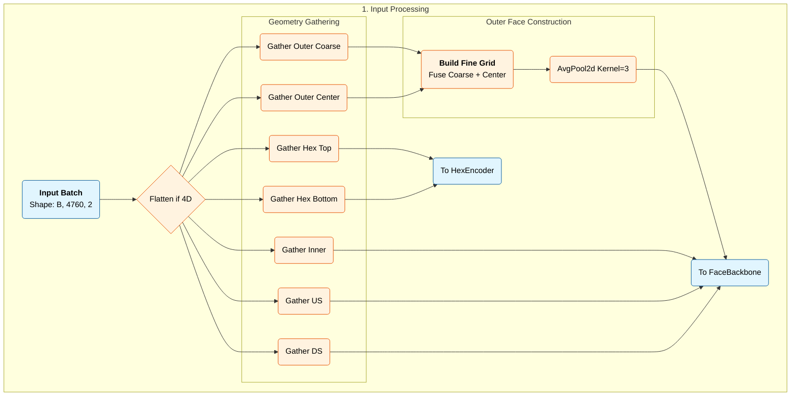

# xec-ml-wl

## Machine Learning Model for the MEG II Liquid Xenon (LXe) Detector

This repository contains machine learning model (CNN + Graph Transformer) to regress physical observables including emission angle (**$\theta$**, **$\phi$**), energy, timing, and position (**uvwFI**) from photons detected by the LXe detector, utilizing both photon count (**$N_{\mathrm{pho}}$**) and timing information (**$t_{\mathrm{pm}}$**) in each photo-sensor (4092 SiPMs and 668 PMTs).

This model respects the complex topology of the detector by combining:
1.  **ConvNeXt V2** for rectangular faces (Inner, Outer, US, DS).
2.  **HexNeXt (Graph Attention)** for hexagonal PMT faces (Top, Bottom).
3.  **Transformer Fusion** to correlate signals across disjoint detector faces.

---

## Quick Reference

| Task | Command | Config |
|------|---------|--------|
| **Train Regressor** | `./scan_param/run_regressor.sh` | `config/train_config.yaml` |
| **MAE Pretraining** | `./scan_param/run_mae.sh` | `config/mae_config.yaml` |
| **Inpainter Training** | `./scan_param/run_inpainter.sh` | `config/inpainter_config.yaml` |
| **ONNX Export** | `python macro/export_onnx.py checkpoint.pth --output model.onnx` | - |
| **MLflow UI** | `mlflow ui --backend-store-uri sqlite:///mlruns.db --port 5000` | - |

**Common Config Overrides (set env vars before running submit script):**
```bash
# Reduce batch size (OOM fix)
BATCH_SIZE=512 ./scan_param/submit_regressor.sh

# Enable multiple tasks
TASKS="angle energy" ./scan_param/submit_regressor.sh

# Use MAE weights for fine-tuning
RESUME_FROM="mae_checkpoint.pth" ./scan_param/submit_regressor.sh
```

**Important:** There are two [normalization schemes](#i-input-normalization). Use **legacy** for existing regressor models, **new** for MAE/inpainter experiments.

---

## Table of Contents

1. [Environment Setup](#1-environment-setup)
   - [A100 Nodes](#1-a100-nodes-a100--partition)
   - [Grace-Hopper Nodes](#2-grace-hopper-nodes-gh--partition)
2. [Usage](#2-usage)
   - [A. Batch Training](#a-batch-training)
   - [B. Interactive Jupyter Session](#b-interactive-jupyter-session)
   - [C. MAE Pre-training](#c-masked-autoencoder-mae-pre-training)
   - [D. Dead Channel Inpainting](#d-dead-channel-inpainting)
   - [F. Multi-Task Learning](#f-multi-task-learning)
   - [G. Sample Reweighting](#g-sample-reweighting)
   - [H. Data Format](#h-data-format)
   - [I. Input Normalization](#i-input-normalization) ⚠️ **Two schemes available**
3. [Output & Artifacts](#3-output--artifacts)
4. [Model Architecture](#4-model-architecture)
   - [A. The Pipeline](#a-the-pipeline)
   - [B. Key Components](#b-key-components)
   - [C. Training Features](#c-training-features) (EMA, Gradient Accumulation, Cosine LR, AMP)
   - [D. FCMAE-Style Masked Convolution](#d-fcmae-style-masked-convolution)
   - [E. References](#e-references) (Paper summaries)
5. [Detector Geometry & Sensor Mapping](#5-detector-geometry--sensor-mapping)
   - [A. Sensor Overview](#a-sensor-overview)
   - [B. Index Maps](#b-index-maps-libgeom_defspy)
   - [C. Outer Face Fine Grid](#c-outer-face-fine-grid-construction)
   - [D. Hexagonal PMT Layout](#d-hexagonal-pmt-layout)
   - [F. Normalization Constants](#f-normalization-constants)
6. [Resuming Training](#6-resuming-training)
7. [Real Data Validation](#7-real-data-validation)
8. [File Dependency](#8-file-dependency)
9. [Troubleshooting](#9-troubleshooting) (OOM, NaN, Slow Loading)
10. [Prospects & Future Work](#10-prospects--future-work)
    - [A. Architecture Improvements](#a-architecture-improvements) (Positional Encoding, Transformer Variants)
    - [B. Training Improvements](#b-training-improvements) (Augmentation, Loss Functions)
    - [C. Model Scaling](#c-model-scaling)
    - [D. Inpainter Improvements](#d-inpainter-improvements)
    - [E. Evaluation & Analysis](#e-evaluation--analysis)
    - [F. Infrastructure](#f-infrastructure)

---

## 1. Environment Setup

The repository supports both **x86 (A100)** and **ARM (Grace-Hopper)** architectures on the Merlin7 cluster. Due to binary incompatibility, **two separate environments** are prepared. 

### First-Time Setup

### 1. A100 Nodes (a100-* partition)

These x86-based nodes use the system Anaconda module:

```bash
$ module load anaconda/2024.08
$ conda env create -f env_setting/xec-ml-wl-gpu.yml

# To update
$ conda env update -f env_setting/xec-ml-wl-gpu.yml --prune

# When changing the python version
$ conda env remove -n xec-ml-wl
$ conda env create -f xec-ml-wl-gpu.yml
```

### 2. Grace-Hopper Nodes (gh-* partition)

These ARM64-based nodes require a custom Miniforge installation.

#### Log in to a GH node:

```bash
$ srun --cluster=gmerlin7 --partition=gh-interactive --gres=gpu:1 --mem=40GB --pty /bin/bash
```

#### Install Miniforge:

```bash
$ wget https://github.com/conda-forge/miniforge/releases/latest/download/Miniforge3-Linux-aarch64.sh

$ bash Miniforge3-Linux-aarch64.sh -b -p $HOME/miniforge-arm
```

#### Create Environment:

```bash
# 1. Prepare the environment
$ source $HOME/miniforge-arm/bin/activate

# 2. Create base with system libs
$ mamba create -n xec-ml-wl-gh python=3.10 numpy scipy pandas matplotlib scikit-learn \
    tqdm pyarrow pyyaml jupyterlab ipykernel uproot awkward vector \
    pytorch-lightning torchmetrics tensorboard onnx mlflow \
    -c conda-forge -y

# 3. Activate
$ conda activate xec-ml-wl-gh

# 4. Install PyTorch (GPU)
$ pip install torch torchvision torchaudio --index-url https://download.pytorch.org/whl/cu124

# 5. Install ONNX Runtime GPU (optional)
$ pip install onnxruntime-gpu
```

#### Update Environment:

```bash
(Assumes already logged into GH node)
# 1. Prepare the environment
$ source $HOME/miniforge-arm/bin/activate
$ mamba env remove -n xec-ml-wl-gh # <- recreating env when changing python version
(optional) $ mamba clean -a -y # Clear cache to free space/remove corrupt tarballs

# 2. Create base environment
mamba create -n xec-ml-wl-gh python=3.12 \
    numpy scipy pandas matplotlib scikit-learn \
    tqdm pyarrow pyyaml jupyterlab ipykernel \
    uproot awkward vector \
    pytorch-lightning=2.4.0 torchmetrics=1.5.0 tensorboard \
    onnx=1.17.0 mlflow \
    -c conda-forge -y

# 3. Activate
$ conda activate xec-ml-wl-gh

# 5. Install PyTorch (GPU)
$ pip install --upgrade pip
$ pip install torch==2.5.1 torchvision==0.20.1 torchaudio==2.5.1 --index-url https://download.pytorch.org/whl/cu124

# 6. Install PyG (skip this if PyG packages are not used in Hex face)
$ pip install torch-scatter torch-sparse torch-cluster torch-spline-conv torch-geometric

# 7. Install ONNX Runtime GPU and others
$ pip install pytorch-lightning==2.4.0 torchmetrics==1.5.0 onnx==1.17.0 onnxruntime

# 8. Verification
$ python -c "import torch; print(f'PyTorch: {torch.__version__}'); print(f'CUDA: {torch.version.cuda}'); print(f'GPU: {torch.cuda.get_device_name(0)}')"
# -> Expected PyTorch: 2.5.1, CUDA: 12.4, GPU: NVIDIA GH200 120GB

```

### 3. Prepare Batch Job

```bash
$ chmod +x start_jupyter_xec_gpu.sh scan_param/*.sh
```

---

## 2. Usage

### A. Batch Training

All training scripts follow a consistent pattern:
- `run_*.sh` - Set environment variables and call submit script
- `submit_*.sh` - Creates and submits SLURM job

The submit scripts automatically detect CPU architecture and activate the correct conda environment (x86 or ARM).

#### 1. Quick Submission (Regressor)

```bash
$ cd scan_param

# Edit run_regressor.sh to set your parameters, then:
$ ./run_regressor.sh

# Or set env vars directly:
$ export RUN_NAME="my_run" CONFIG_PATH="config/train_config.yaml" PARTITION="a100-daily"
$ ./submit_regressor.sh
```

#### 2. Config + CLI Overrides

Override specific parameters via environment variables:

```bash
# Override epochs and learning rate
$ EPOCHS=100 LR=1e-4 ./submit_regressor.sh

# Enable multiple tasks
$ TASKS="angle energy" ./submit_regressor.sh
```

#### 3. Direct Python Training

```bash
# Config-based training
$ python -m lib.train_regressor --config config/train_config.yaml

# With CLI overrides
$ python -m lib.train_regressor --config config/train_config.yaml --lr 1e-4 --epochs 30
```

#### 4. Optimization Best Practices

For GH nodes, use the following settings to maximize throughput:
* **Batch Size**: 16384 (Uses ~65GB VRAM, ~70% capacity)
* **Chunk Size**: 524880 (320 Batches)
* **Memory**: Normally uses 5-10GB RAM

### B. Interactive Jupyter Session

```bash
# Syntax:
# ./start_jupyter_xec_gpu.sh [PARTITION] [TIME] [PORT]
./start_jupyter_xec_gpu.sh gh-interactive 02:00:00 8888
```
1. Wait for the connection URL.
2. Tunnel ports locally: `ssh -N -L 8888:localhost:8888 -J <user>@login001 <user>@gpuXXX`
3. Paste the URL with token in the browser.

### C. Masked Autoencoder (MAE) Pre-training

The library supports self-supervised pre-training using a Masked Autoencoder (MAE) approach. This allows the model to learn geometric features from the raw detector data without requiring ground-truth labels.

#### 1. Architecture Overview

The MAE (`XEC_MAE`) consists of an encoder and face-specific decoders:

```
Input: (B, 4760, 2) sensor values (npho, time)
    ↓
┌─────────────────────────────────────────┐
│  Masking (Invalid-Aware)                          │
│  - Exclude already-invalid sensors      │
│  - Randomly mask `mask_ratio` of valid  │
│  - Set masked positions to sentinel     │
└─────────────────────────────────────────┘
    ↓
┌─────────────────────────────────────────┐
│  XECEncoder (shared with regression)    │
│  - Per-face ConvNeXt/HexNeXt backbones  │
│  - Transformer fusion                   │
│  - Output: 6 latent tokens (1024-dim)   │
└─────────────────────────────────────────┘
    ↓
┌─────────────────────────────────────────┐
│  Face-Specific Decoders                 │
│                                         │
│  FaceDecoder (Inner, US, DS, Outer):    │
│  - Linear: 1024 → 256×4×4               │
│  - ConvTranspose2d: 256→128 (4→8)       │
│  - ConvTranspose2d: 128→64  (8→16)      │
│  - ConvTranspose2d: 64→2    (16→16)     │
│  - Bilinear interpolate to face size    │
│                                         │
│  GraphFaceDecoder (Top, Bottom):        │
│  - Project latent → all nodes           │
│  - Add learnable positional embedding   │
│  - 2× HexNeXtBlock (graph attention)    │
│  - LayerNorm → Linear → 2 channels      │
└─────────────────────────────────────────┘
    ↓
Output: Reconstructed (npho, time) per face
Loss: Computed only on masked positions
```

**Decoder Output Dimensions:**

| Face | Decoder | Output Shape |
|------|---------|--------------|
| Inner | FaceDecoder | (B, 2, 93, 44) |
| US | FaceDecoder | (B, 2, 24, 6) |
| DS | FaceDecoder | (B, 2, 24, 6) |
| Outer (coarse) | FaceDecoder | (B, 2, 9, 24) |
| Outer (finegrid, pooled 3×3) | FaceDecoder | (B, 2, 15, 24) |
| Top | GraphFaceDecoder | (B, 2, 73) |
| Bottom | GraphFaceDecoder | (B, 2, 73) |

#### 2. Masking Strategy

The MAE uses **invalid-aware masking** to properly handle already-invalid sensors in MC data:

```python
# Pseudocode for invalid-aware masking
already_invalid = (time == sentinel_value)  # Sensors without valid data
valid_sensors = ~already_invalid

# Only mask from valid sensors
num_to_mask = int(valid_sensors.sum() * mask_ratio)
mask = random_select(valid_sensors, num_to_mask)

# Apply sentinel to masked positions
x_masked[mask] = sentinel_value

# Loss computed only on `mask` (not on already_invalid)
```

**Key Properties:**
- **Already-invalid sensors** (where `time == sentinel`) are excluded from random masking
- **mask_ratio** applies to valid sensors only (e.g., 60% of ~4500 valid → ~2700 masked)
- **Loss** is computed only on randomly-masked positions (ground truth available)
- **actual_mask_ratio** metric tracks effective masking: `randomly_masked / valid_sensors`

#### 3. Loss Computation

Loss is computed **only on masked positions** where ground truth exists:

$$\mathcal{L} = \sum_{\text{face}} \left( w_{\text{npho}} \cdot \mathcal{L}_{\text{npho}}^{\text{face}} + w_{\text{time}} \cdot \mathcal{L}_{\text{time}}^{\text{face}} \right)$$

Where for each face:
$$\mathcal{L}_{\text{channel}}^{\text{face}} = \frac{1}{|\text{mask}|} \sum_{i \in \text{mask}} \ell(y_i^{\text{pred}}, y_i^{\text{true}})$$

Supported loss functions: `mse`, `l1`, `smooth_l1`

**Optional: Homoscedastic Channel Weighting**

When `learn_channel_logvars=True`, the model learns per-channel uncertainty:
$$\mathcal{L} = \frac{1}{2\sigma_{\text{npho}}^2} \mathcal{L}_{\text{npho}} + \frac{1}{2\sigma_{\text{time}}^2} \mathcal{L}_{\text{time}} + \log\sigma_{\text{npho}} + \log\sigma_{\text{time}}$$

#### 4. Quick Start

```bash
# CLI mode (legacy)
python -m lib.train_mae --train_root /path/to/data.root --save_path mae_pretrained.pth --epochs 20 --batch_size 1024

# Finegrid outer face (optional)
python -m lib.train_mae --train_root /path/to/data.root --save_path mae_pretrained.pth --epochs 20 --batch_size 1024 \
  --outer_mode finegrid --outer_fine_pool 3 3

# Config mode (recommended)
python -m lib.train_mae --config config/mae_config.yaml

# Config + CLI override
python -m lib.train_mae --config config/mae_config.yaml --epochs 50 --train_root /path/to/train
```

#### 5. Running Pre-training

Dedicated scripts are under `scan_param/` to streamline the MAE workflow.

1. Configure the Run: Edit `scan_param/run_mae.sh` to set desired parameters:

    - `ROOT_PATH`: Path to the dataset (wildcards supported)
    - `EPOCHS`: Number of pre-training epochs
    - `MASK_RATIO`: Percentage of valid sensors to mask (default `0.6`)
    - `BATCH`: Batch size

2. Submit the Job:

    ```bash
    cd scan_param
    ./run_mae.sh
    ```
    This submits a SLURM job using `submit_mae.sh`

3. Output: Checkpoints will be saved to `~/meghome/xec-ml-wl/artifacts/<RUN_NAME>/`. The weights file is typically named `mae_checkpoint_best.pth`

#### 6. Metrics

| Metric | Description |
|--------|-------------|
| `total_loss` | Combined weighted loss (sum across faces) |
| `loss_npho` / `loss_time` | Per-channel losses (sum across faces) |
| `loss_{face}` | Per-face total loss |
| `loss_{face}_npho/time` | Per-face, per-channel losses |
| `mae_npho` / `mae_time` | Mean Absolute Error on masked positions |
| `rmse_npho` / `rmse_time` | Root Mean Square Error on masked positions |
| `mae_{face}_npho/time` | Per-face MAE |
| `rmse_{face}_npho/time` | Per-face RMSE |
| `actual_mask_ratio` | Effective mask ratio after excluding invalid sensors |

#### 7. Fine-Tuning for Regression

Once pre-training is complete, load the learned encoder weights into the regression model:

1. **Configure Regression**: Edit `scan_param/run_scan.sh`.
2. **Set Resume Path**: Point the `RESUME_FROM` variable to your MAE checkpoint:
    ```bash
    RESUME_FROM="$HOME/meghome/xec-ml-wl/artifacts/<RUN_NAME>/mae_checkpoint_best.pth"
    ```
3. **Run Regression**: Submit the training job as usual:
    ```bash
    ./run_scan.sh
    ```

**Note on Weight Loading**: The training script (`lib/train_regressor.py`) automatically detects the type of checkpoint provided:

- **Full checkpoint**: If resuming a regression run, it loads the optimizer state, epoch, and full model to continue exactly where it left off.
- **MAE Weights**: If loading an MAE file, it detects "raw weights", loads only the encoder (skipping the regression head), initializes the EMA model correctly, and resets the epoch counter to 1 for fresh fine-tuning

#### 8. Configuration Reference

Key parameters in `config/mae_config.yaml`:

| Parameter | Default | Description |
|-----------|---------|-------------|
| `mask_ratio` | 0.65 | Fraction of valid sensors to mask |
| `time_mask_ratio_scale` | 1.0 | Bias masking toward valid-time sensors (>1.0 prefers valid-time) |
| `outer_mode` | "finegrid" | Outer face mode (`finegrid` or `split`) |
| `outer_fine_pool` | [3, 3] | Pooling kernel for finegrid outer |
| `loss_fn` | "smooth_l1" | Loss function (smooth_l1, mse, l1, huber) |
| `npho_weight` | 1.0 | Weight for npho channel loss |
| `time_weight` | 1.0 | Weight for time channel loss |
| `auto_channel_weight` | false | Learn channel weights automatically |
| `npho_threshold` | 100 | Min npho for time loss (skip low-signal sensors) |
| `use_npho_time_weight` | true | Weight time loss by sqrt(npho) |
| `track_mae_rmse` | false | Compute MAE/RMSE metrics (slower) |
| `track_train_metrics` | false | Per-face training metrics |
| `grad_accum_steps` | 1 | Gradient accumulation steps |
| `ema_decay` | null | EMA decay rate (null=disabled, 0.999 typical) |

**Note:** Use the **new normalization scheme** (npho_scale=1000, sentinel_value=-1.0) for MAE pretraining. See [Input Normalization](#i-input-normalization) for details.

### D. Dead Channel Inpainting

The library includes a **dead channel inpainting** module for recovering sensor values at malfunctioning or dead channels. This is useful for:
- **Data recovery**: Interpolate missing sensor readings using surrounding context
- **Robustness training**: Train models to handle incomplete detector data
- **Preprocessing**: Clean up data before regression tasks

#### 1. Architecture Overview

The inpainter (`XEC_Inpainter`) uses a frozen encoder from MAE pretraining combined with lightweight inpainting heads:

```
Input (with dead channels marked as sentinel)
    ↓
┌─────────────────────────────────────────┐
│  Frozen XECEncoder (from MAE)           │
│  - Extracts latent tokens per face      │
│  - Global context from transformer      │
└─────────────────────────────────────────┘
    ↓
┌─────────────────────────────────────────┐
│  Face-Specific Inpainting Heads         │
│                                         │
│  Rectangular (Inner, US, DS, Outer):    │
│  - FaceInpaintingHead                   │
│  - Local CNN (2× ConvNeXtV2 blocks)     │
│  - Global conditioning from latent      │
│  - Hidden dim: 64                       │
│                                         │
│  Hexagonal (Top, Bottom):               │
│  - HexInpaintingHead                    │
│  - Local GNN (3× HexNeXt blocks)        │
│  - Global conditioning from latent      │
│  - Hidden dim: 96                       │
└─────────────────────────────────────────┘
    ↓
Output: Predicted (npho, time) at masked positions only
```

#### 2. Masking Strategy

The inpainter uses **invalid-aware masking** to handle already-invalid sensors in the data:

- **Already-invalid sensors** (where `time == sentinel_value`) are excluded from the random masking pool
- **Random masking** is applied only to valid sensors at the specified `mask_ratio`
- **Loss computation** uses only randomly-masked positions (where ground truth exists)
- **actual_mask_ratio** metric tracks the effective masking: `randomly_masked / valid_sensors`

This ensures:
1. No loss is computed on sensors without ground truth (already-invalid in MC)
2. The model learns to predict from real neighboring context, not from sentinel values

#### 3. Training Modes

**Option A: With MAE Pre-training (Recommended)**

```bash
# First, train MAE
python -m lib.train_mae --config config/mae_config.yaml

# Then, train inpainter with frozen MAE encoder
python -m lib.train_inpainter --config config/inpainter_config.yaml \
    --mae_checkpoint artifacts/mae/mae_checkpoint_best.pth
```

**Option B: Without MAE Pre-training (From Scratch)**

```bash
# Train inpainter without MAE (encoder trained jointly)
python -m lib.train_inpainter --config config/inpainter_config.yaml \
    --mae_checkpoint ""
```

**Interactive Training Script:**

```bash
# Edit configuration in the script first
./macro/interactive_inpainter_train_config.sh
```

#### 4. Configuration

Configure in `config/inpainter_config.yaml`:

```yaml
# Model
model:
  outer_mode: "finegrid"        # Must match MAE encoder config
  outer_fine_pool: [3, 3]       # Must match MAE encoder config
  mask_ratio: 0.05              # Realistic dead channel density (1-10%)
  freeze_encoder: true          # Freeze encoder, train only heads

# Training
training:
  mae_checkpoint: "artifacts/mae/checkpoint_best.pth"  # or null
  epochs: 50
  lr: 1.0e-4
  lr_scheduler: "cosine"
  loss_fn: "smooth_l1"          # smooth_l1, mse, l1
  npho_weight: 1.0
  time_weight: 1.0
```

#### 5. Metrics

| Metric | Description |
|--------|-------------|
| `total_loss` | Combined weighted loss (npho + time) |
| `loss_npho` / `loss_time` | Per-channel losses (sum across faces) |
| `loss_{face}_npho/time` | Per-face, per-channel losses |
| `mae_npho` / `mae_time` | Mean Absolute Error on masked positions |
| `rmse_npho` / `rmse_time` | Root Mean Square Error on masked positions |
| `actual_mask_ratio` | Effective mask ratio after excluding invalid sensors |
| `n_masked_total` | Total number of masked sensors in batch |

#### 6. Output

- **Checkpoints**: `artifacts/inpainter/checkpoint_best.pth`, `checkpoint_last.pth`
- **ROOT Predictions**: `inpainter_predictions_epoch_*.root` (every 10 epochs)
  - Branches: `event_idx`, `sensor_id`, `face`, `truth_npho`, `truth_time`, `pred_npho`, `pred_time`, `error_npho`, `error_time`

### F. Multi-Task Learning

The model supports simultaneous regression of multiple physical observables. Configure tasks in `config/train_config.yaml`:

```yaml
tasks:
  angle:
    enabled: true
    loss_fn: "smooth_l1"    # smooth_l1, l1, mse, huber
    loss_beta: 1.0
    weight: 1.0
  energy:
    enabled: false
    loss_fn: "l1"
    weight: 1.0
  timing:
    enabled: false
    loss_fn: "l1"
    weight: 1.0
  uvwFI:
    enabled: false
    loss_fn: "mse"
    weight: 1.0
```

**Models:**
- `XECEncoder`: Single-task (angle-only, legacy)
- `XECMultiHeadModel`: Multi-task with shared backbone and task-specific heads

**Task Output Dimensions:**
| Task | Output | Description |
|------|--------|-------------|
| `angle` | 2 | (θ, φ) emission angles |
| `energy` | 1 | Energy |
| `timing` | 1 | Timing |
| `uvwFI` | 3 | (u, v, w) position coordinates |

**Experimental Heads** (available but not fully tested):
| Task | Output | Description |
|------|--------|-------------|
| `angleVec` | 3 | Emission direction unit vector (x, y, z) |
| `n_gamma` | 5 | Number of gammas classification (0-4) |

### G. Sample Reweighting

Balance training distributions using histogram-based reweighting. This helps when certain regions (e.g., specific angles or energies) are underrepresented in training data.

Configure in `config/train_config.yaml`:

```yaml
reweighting:
  angle:
    enabled: true
    nbins_2d: [20, 20]    # (theta_bins, phi_bins)
  energy:
    enabled: false
    nbins: 30
  timing:
    enabled: false
    nbins: 30
  uvwFI:
    enabled: false
    nbins_2d: [10, 10]    # (u_bins, v_bins) - uses same for w
```

The `SampleReweighter` class (`lib/reweighting.py`) fits histograms on training data and computes per-sample weights to balance underrepresented regions during training.

### H. Data Format

ROOT files with TTree structure. Default tree name: `tree`.

**Input Branches** (shape: 4760 per event):
| Branch | Description |
|--------|-------------|
| `relative_npho` | Normalized photon counts per sensor |
| `relative_time` | Normalized timing per sensor |

**Truth Branches:**
| Branch | Shape | Description |
|--------|-------|-------------|
| `emiAng` | (2,) | Emission angle (θ, φ) |
| `energyTruth` | (1,) | True gamma energy |
| `timeTruth` | (1,) | True gamma timing |
| `uvwTruth` | (3,) | First interaction position (u, v, w) |
| `xyzTruth` | (3,) | First interaction position (x, y, z) |
| `emiVec` | (3,) | Emission direction unit vector |
| `xyzVTX` | (3,) | Vertex position (gamma origin) |
| `run` | (1,) | Run number |
| `event` | (1,) | Event number |

### I. Input Normalization

All training paths (Regressor, MAE, Inpainter) use the same normalization pipeline. **Critical:** The encoder learns features based on the input distribution, so models trained with different normalization schemes are **not compatible**.

#### 1. Normalization Schemes

There are currently **two normalization schemes** in use:

| Scheme | Use Case | When to Use |
|--------|----------|-------------|
| **Legacy** | Regressor training, existing models | Backward compatibility with older checkpoints |
| **New** | MAE/Inpainter, new experiments | Better numerical stability, recommended for new work |

**Parameter Comparison:**

| Parameter | Legacy Scheme | New Scheme | Notes |
|-----------|---------------|------------|-------|
| `npho_scale` | 0.58 | 1000 | First log1p scale factor |
| `npho_scale2` | 1.0 | 4.08 | Second scale factor |
| `time_scale` | 6.5e-8 | 1.14e-7 | Time normalization (seconds) |
| `time_shift` | 0.5 | -0.46 | Time offset after scaling |
| `sentinel_value` | -5.0 | -1.0 | Invalid sensor marker |

**Important:** When using MAE pretraining for fine-tuning, ensure all downstream models use the **same** normalization scheme as the MAE.

#### 2. Normalization Formulas

**Photon Count (Npho) - Extensive Quantity:**
```python
# Log-transform to handle wide dynamic range (0 to ~10^6 photons)
npho_norm = log1p(raw_npho / npho_scale) / npho_scale2
```

$$N_{\text{norm}} = \frac{\ln(1 + N_{\text{raw}} / s_1)}{s_2}$$

Where:
- $s_1$ = `npho_scale`
- $s_2$ = `npho_scale2`

**Timing - Intensive Quantity:**
```python
# Linear transform to center around 0
time_norm = (raw_time / time_scale) - time_shift
```

$$t_{\text{norm}} = \frac{t_{\text{raw}}}{s_t} - \delta_t$$

Where:
- $s_t$ = `time_scale`
- $\delta_t$ = `time_shift`

#### 3. Invalid Sensor Detection

Sensors are marked as **invalid** based on these conditions:

```python
# Npho invalid if:
mask_npho_bad = (raw_npho <= 0.0) | (raw_npho > 9e9) | isnan(raw_npho)

# Time invalid if npho is bad OR time itself is bad:
mask_time_bad = mask_npho_bad | (abs(raw_time) > 9e9) | isnan(raw_time)
```

**Invalid Sensor Handling:**
| Channel | Invalid Value | Reason |
|---------|---------------|--------|
| Npho | `0.0` | Zero photons is physically valid, acts as "no signal" |
| Time | `sentinel_value` | Distinctive value far from valid range (~0 after normalization) |

#### 4. Sentinel Value System

The **sentinel value** marks sensors where timing information is unavailable:

**Why use a sentinel value far from valid range?**
- Valid normalized time is typically in range [-1, 1] after shifting
- A value like -5.0 (legacy) or -1.0 (new) is far outside this range
- Convolution operations will "see" this as a strong negative signal

**Detection in Models:**
```python
# Identify already-invalid sensors
already_invalid = (x[:, :, 1] == sentinel_value)  # Check time channel
```

**Masking (Invalid-Aware) (MAE/Inpainter):**
- Already-invalid sensors are excluded from random masking pool
- Loss is computed only on randomly-masked positions (where ground truth exists)
- See `actual_mask_ratio` metric for effective masking after exclusions

#### 5. Typical Value Ranges

After normalization with the **legacy scheme** (npho_scale=0.58):

| Channel | Valid Range | Mean | Std |
|---------|-------------|------|-----|
| Npho (normalized) | [0, ~3] | ~0.5 | ~0.5 |
| Time (normalized) | [-1, 1] | ~0 | ~0.3 |
| Time (invalid) | -5.0 | - | - |

After normalization with the **new scheme** (npho_scale=1000):

| Channel | Valid Range | Mean | Std |
|---------|-------------|------|-----|
| Npho (normalized) | [0, ~2.5] | ~1.0 | ~0.7 |
| Time (normalized) | [-1.5, 1.5] | ~0 | ~0.4 |
| Time (invalid) | -1.0 | - | - |

#### 6. Configuration Parameters

| Parameter | Config Key | Legacy | New | Description |
|-----------|------------|--------|-----|-------------|
| `npho_scale` | `normalization.npho_scale` | 0.58 | 1000 | Npho log transform scale |
| `npho_scale2` | `normalization.npho_scale2` | 1.0 | 4.08 | Secondary npho scale |
| `time_scale` | `normalization.time_scale` | 6.5e-8 | 1.14e-7 | Time scale (seconds) |
| `time_shift` | `normalization.time_shift` | 0.5 | -0.46 | Time offset after scaling |
| `sentinel_value` | `normalization.sentinel_value` | -5.0 | -1.0 | Invalid sensor marker |

**Important:** All training paths (Regressor, MAE, Inpainter) must use the **same normalization parameters** for the encoder to work correctly. The inpainter must match the MAE's normalization.

#### 7. Inverse Transform (for Inference)

To convert predictions back to physical units:

```python
# Npho: inverse of log1p transform
raw_npho = npho_scale * (exp(npho_norm * npho_scale2) - 1)

# Time: inverse of linear transform
raw_time = (time_norm + time_shift) * time_scale
```

---

## 3. Output & Artifacts

All results are logged to **MLflow** and stored in the `artifacts/<RUN_NAME>/` directory.

### Key Artifacts

* `checkpoint_best.pth` — Best model weights (includes EMA state).
* `checkpoint_last.pth` — Last epoch's model weights (includes EMA state).
* `predictions_*.csv` — Validation predictions vs truth.
* `*.onnx` — Exported ONNX model for C++ inference (supports single-task and multi-task).
* `validation_results_*.root` — ROOT file containing event-by-event predictions and truth variables.

### Plots

* `resolution_profile_*.pdf`: 68% width resolution vs $\theta$/$\phi$.
* `saliency_profile_*.pdf`: Physics Sensitivity analysis (Gradient of output w.r.t input Npho/Time).
* `worst_event_*.pdf`: Event displays of the highest-loss events.
* `saliency_profile_*.pdf`: Computes $\nabla_{\text{Input}} \text{Output}$ to quantify how much the model relies on Photon Counts vs Timing for each face (Inner, Top, Hex, etc.) to determine $\theta$ and $\phi$.

### Visualization Tools

The real time tracking of the training is available with MLflow and TensorBoard.
```bash
# Start MLflow (Track metrics & PDFs)
$ cd /path/to/xec-ml-wl
$ (activate xec-ml-wl conda environment)
$ mlflow ui --backend-store-uri sqlite:///$(pwd)/mlruns.db --host 127.0.0.1 --port 5000

# Start TensorBoard (Track Loss Curves)
$ tensorboard --logdir runs --host 0.0.0.0 --port YYYY
```

### Metrics Definition

#### 1. Physics Performance Metrics

These metrics evaluate the quality of the photon direction reconstruction. They are calculated during the validation phase using `eval_stats` and `eval_resolution`.

| Metric | Definition | Formula |
| ------ | ---------- | ------- | 
| Theta Bias (`theta_bias`) | The arithmetic mean of the residuals. | $\mu = \text{Mean}(\theta_{\mathrm{pred}} - \theta_{\mathrm{true}})$ |
| Theta RMS (`theta_rms`) | The standard deviation of the residuals. | $\sigma = \text{Std}(\theta_{\mathrm{pred}} - \theta_{\mathrm{true}})$ |
| Theta Skewness (`theta_skew`) | A measure of the asymmetry of the error distribution. | $$\text{Skew} = \frac{\frac{1}{N} \sum_{i=1}^{N} (\Delta \theta_i - \mu)^3}{\left( \frac{1}{N} \sum_{i=1}^{N} (\Delta \theta_i - \mu)^2 \right)^{3/2}}$$ |
| Opening Angle Resolution (`val_resolution_deg`) | The 68th percentile of the 3D opening angle $\psi$ between the predicted and true vectors. | $\psi = \arccos(v_{\mathrm{pred}} \cdot v_{\mathrm{true}})$ |

#### 2. System Engineering Metrics
These metrics monitor the health of the training infrastructure (GPU/CPU) to detect bottlenecks or imminent crashes.

| Metric           | Key in MLflow                    | Interpretation                                                                            |
| ---------------- | -------------------------------- | --------------------------------- |
| Allocated Memory | `system/` `memory_allocated_GB`  | The actual size of tensors (weights, gradients, data) on the GPU. Steady growth indicates a memory leak.Reserved Memorysystem/memory_reserved_GBThe total memory PyTorch has requested from the OS. If this hits the hardware limit, an OOM crash occurs.                                                      |
| Peak Memory      | `system/` `memory_peak_GB`       | The highest memory usage recorded (usually during the backward pass). Use this to tune batch_size.                          |
| GPU Utilization  | `system/` `gpu_utilization_pct`  | Ratio of Allocated to Total VRAM. Low values (<50%) suggest the batch size can be increased; very high values (>90%) risk OOM.  |
| Fragmentation    | `system/` `memory_fragmentation` | Ratio of empty space within reserved memory blocks. High fragmentation (>0.5) indicates inefficient memory use.                | 
| RAM Usage        | `system/` `ram_used_gb`          | System RAM used by the process. High usage warns that step_size for ROOT file reading is too large.                            | 
| Throughput       | `system/` `epoch_duration_sec`   | Wall-clock time per epoch. If high while GPU utilization is low, the pipeline is CPU-bound (data loading bottleneck).        |

#### 3. System Performance Metrics
These metrics determine if the training pipeline is efficient or bottlenecked.
| Metric             | Key in MLflow                      | Definition & goal                 |
| ------------------ | ---------------------------------- | --------------------------------- |
| Throughput         | `system/throughput_events_per_sec` | Events processed per second.      |
| Data Load Time     | `system/avg_data_load_sec`         | Time GPU waits for CPU. If high, increase CHUNK_SIZE. |
| Compute Efficiency | `system/compute_efficiency`        | % of time GPU is computing.       |

---

## 4. Model Architecture

The model (`XECEncoder`) utilizes a multi-branch architecture to handle the heterogeneous sensor geometry (SiPMs vs PMTs), followed by an attention-based fusion mechanism.

### A. The Pipeline

```mermaid
graph TD
    %% -- Styles --
    classDef tensor fill:#e1f5fe,stroke:#01579b,stroke-width:1px,color:#000000;
    classDef op fill:#fff3e0,stroke:#e65100,stroke-width:1px,color:#000000;
    classDef block fill:#e8f5e9,stroke:#1b5e20,stroke-width:2px,color:#000000;
    classDef fusion fill:#f3e5f5,stroke:#4a148c,stroke-width:2px,color:#000000;
    classDef param fill:#fff9c4,stroke:#fbc02d,stroke-dasharray: 5 5,color:#000000;

    %% ==========================================
    %% 2. CNN BACKBONE (SHARED)
    %% ==========================================
    subgraph "2. ConvNeXt V2 Path"
        FaceIn(Face Input):::tensor

        %% Stem
        subgraph "Stem"
            StemConv("Conv2d 2->32<br/>k=4, s=1, p=1"):::op
            StemLN(LayerNorm):::op
        end

        %% Stage 1
        subgraph "Stage 1 (Dim=32)"
            CNBlock1("<b>ConvNeXtV2 Block 1</b><br/>DWConv k=7 -> LN -> PWLinear -> GELU -> GRN -> PWLinear"):::block
            CNBlock2("<b>ConvNeXtV2 Block 2</b><br/>DWConv k=7 -> LN -> PWLinear -> GELU -> GRN -> PWLinear"):::block
        end
        
        %% Downsample
        subgraph "Downsample"
            DS_LN(LayerNorm):::op
            DS_Conv("Conv2d 32->64<br/>k=2, s=2"):::op
        end

        %% Stage 2
        subgraph "Stage 2 (Dim=64)"
            CNBlock3(<b>ConvNeXtV2 Block 1</b>):::block
            CNBlock4(<b>ConvNeXtV2 Block 2</b>):::block
            CNBlock5(<b>ConvNeXtV2 Block 3</b>):::block
        end

        %% Output
        Interp(Interpolate to 4x4):::op
        FlatCNN(Flatten):::op
        FaceOut("<b>Face Token</b><br/>Dim: 1024"):::tensor
    end

    %% ==========================================
    %% 3. HEX ENCODER (SHARED)
    %% ==========================================
    subgraph "3. GraphAttention Path"
        HexIn(Hex Nodes):::tensor
        
        %% Stem
        subgraph "Hex Stem"
            HexStemLin(Linear 2->96):::op
            HexStemLN(LayerNorm):::op
            HexStemAct(GELU):::op
        end
        
        %% HexNeXt Stack
        subgraph "HexNeXt Stack (4 Layers)"
            HNBlock1("<b>HexNeXt Block 1</b><br/>HexDepthwise -> LN -> Linear -> GELU -> GRN -> Linear"):::block
            HNBlock2(<b>HexNeXt Block 2</b>):::block
            HNBlock3(<b>HexNeXt Block 3</b>):::block
            HNBlock4(<b>HexNeXt Block 4</b>):::block
        end
        
        %% Pooling
        HexPool(Global Mean Pool):::op
        
        %% Projection
        subgraph "Projection"
            HexProjLN(LayerNorm):::op
            HexProjLin(Linear 96->1024):::op
        end
        
        HexOut("<b>Hex Token</b><br/>Dim: 1024"):::tensor
    end

    %% ==========================================
    %% 4. FUSION & HEAD
    %% ==========================================
    subgraph "4. Fusion & Regression (XECEncoder)"
        TokenStack("<b>Stack Tokens</b><br/>[Inner, US, DS, Outer, Top, Bot]<br/>Shape: (B, 6, 1024)"):::op
        PosEmbed(Add Pos Embed):::op
        
        subgraph "Transformer Encoder (Dim=1024)"
            TransL1("<b>Layer 1</b><br/>SelfAttn 8-Head -> Add&Norm -> FeedForward 4096 -> Add&Norm"):::fusion
            TransL2("<b>Layer 2</b><br/>SelfAttn 8-Head -> Add&Norm -> FeedForward 4096 -> Add&Norm"):::fusion
        end
        
        FlatAll("<b>Flatten Sequence</b><br/>Dim: 6 * 1024 = 6144"):::op
        
        subgraph "Regression Head"
            HeadLin1(Linear 6144 -> 256):::op
            HeadLN(LayerNorm):::op
            HeadGELU(GELU):::op
            HeadDrop(Dropout 0.2):::op
            HeadLin2(Linear 256 -> 2):::op
        end
        
        FinalOut(("<b>Output</b><br/>Theta, Phi")):::tensor
    end

    %% ==========================================
    %% CONNECTIONS
    %% ==========================================
    
    %% CNN Flow
    FaceIn --> StemConv --> StemLN --> CNBlock1
    CNBlock1 --> CNBlock2 --> DS_LN --> DS_Conv
    DS_Conv --> CNBlock3 --> CNBlock4 --> CNBlock5
    CNBlock5 --> Interp --> FlatCNN --> FaceOut
    
    %% Hex Flow
    HexIn --> HexStemLin --> HexStemLN --> HexStemAct
    HexStemAct --> HNBlock1 --> HNBlock2 --> HNBlock3 --> HNBlock4
    HNBlock4 --> HexPool --> HexProjLN --> HexProjLin --> HexOut
    
    %% Fusion Flow
    FaceOut --> TokenStack
    HexOut --> TokenStack
    TokenStack --> PosEmbed --> TransL1 --> TransL2
    TransL2 --> FlatAll --> HeadLin1 --> HeadLN --> HeadGELU --> HeadDrop --> HeadLin2 --> FinalOut
```




### B. Key Components

#### 1. Rectangular Branch: ConvNeXt V2

**Faces**: Inner (93×44), Outer Fine Grid (45×72), Upstream (24×6), Downstream (24×6)

**Architecture**: Uses ConvNeXt V2 blocks with Global Response Normalization (GRN):

```
Input: (B, 2, H, W)  # 2 channels: npho, time
    │
    ▼
┌─────────────┐
│    Stem     │  Conv2d(2→32, k=4) + LayerNorm
└─────────────┘
    │
    ▼
┌─────────────┐
│  Stage 1    │  2× ConvNeXtV2Block (dim=32)
└─────────────┘
    │
    ▼
┌─────────────┐
│ Downsample  │  LayerNorm + Conv2d(32→64, k=2, s=2)
└─────────────┘
    │
    ▼
┌─────────────┐
│  Stage 2    │  3× ConvNeXtV2Block (dim=64)
└─────────────┘
    │
    ▼
┌─────────────┐
│ Adaptive    │  Bilinear interpolation to 4×4
│ Pooling     │
└─────────────┘
    │
    ▼
Output: (B, 1024)  # Flattened: 64 × 4 × 4 = 1024
```

**ConvNeXtV2 Block** (`lib/model_blocks.py:76`):
```
Input x ─────────────────────────────────┐
    │                                    │ (residual)
    ▼                                    │
┌─────────────────┐                      │
│ DWConv 7×7      │  Depthwise spatial   │
└─────────────────┘                      │
    │                                    │
    ▼                                    │
┌─────────────────┐                      │
│ LayerNorm       │                      │
└─────────────────┘                      │
    │                                    │
    ▼                                    │
┌─────────────────┐                      │
│ Linear (→4×dim) │  Expand to 4× width  │
└─────────────────┘                      │
    │                                    │
    ▼                                    │
┌─────────────────┐                      │
│ GELU            │                      │
└─────────────────┘                      │
    │                                    │
    ▼                                    │
┌─────────────────┐                      │
│ GRN             │  Global Response Norm│
└─────────────────┘                      │
    │                                    │
    ▼                                    │
┌─────────────────┐                      │
│ Linear (→dim)   │  Project back        │
└─────────────────┘                      │
    │                                    │
    ▼                                    │
    + ◄──────────────────────────────────┘
    │
Output
```

#### 2. Hexagonal Branch: HexNeXt (Graph Convolution)

**Faces**: Top PMT array (334 nodes), Bottom PMT array (334 nodes)

**Problem**: PMTs are arranged in a hexagonal lattice, not a rectangular grid. Standard 2D convolutions don't work here.

**Solution**: Use graph convolution where each PMT is a node, and edges connect neighboring PMTs (6 neighbors per node in the interior).

##### HexDepthwiseConv: The Core Operation

Unlike standard Graph Attention Networks (GAT) which learn attention weights dynamically per input, our `HexDepthwiseConv` uses **learnable position-dependent weights** - more similar to a depthwise convolution kernel adapted for hexagonal grids.

```
        ┌─────┐
       /       \
  ┌───┐    0    ┌───┐
  │ 5 │         │ 1 │     Hexagonal neighborhood:
  └───┘         └───┘     - Center node (0)
 /     \       /     \    - 6 neighbors (1-6)
┌───┐   ┌─────┐   ┌───┐   - Each position has a learned weight
│ 4 │   │  c  │   │ 2 │
└───┘   └─────┘   └───┘
       \       /
        ┌───┐
        │ 3 │
        └───┘
```

**How it works** (`lib/model_blocks.py:172`):

```python
class HexDepthwiseConv(nn.Module):
    def __init__(self, dim):
        # 7 learnable weights: 1 for center + 6 for neighbors
        self.weight = nn.Parameter(torch.randn(1, 7, dim) * 0.02)
        self.bias = nn.Parameter(torch.zeros(1, 1, dim))

    def forward(self, x, edge_index):
        # x: (B, N, C) - node features
        # edge_index: [src, dst, neighbor_type] - graph structure

        # 1. Gather neighbor features
        neighbor_features = x[:, src, :]  # (B, Edges, C)

        # 2. Apply position-dependent weights
        # neighbor_type ∈ {0,1,2,3,4,5,6} indicates which neighbor position
        w_per_edge = self.weight[0, neighbor_type, :]  # (Edges, C)
        weighted_msgs = neighbor_features * w_per_edge

        # 3. Aggregate weighted messages to destination nodes
        out = scatter_add(weighted_msgs, dst)  # Sum neighbors

        return out + self.bias
```

**Key difference from GAT:**
- **GAT**: Computes attention weights dynamically from input features → O(n²) for dense graphs
- **HexDepthwiseConv**: Uses fixed positional weights learned during training → O(n) operations
- Our approach is more efficient and exploits the regular hexagonal structure

##### HexNeXtBlock: Full Block Structure

The HexNeXtBlock mirrors ConvNeXtV2Block but replaces 2D depthwise conv with graph depthwise conv:

```
Input x ─────────────────────────────────┐
    │                                    │ (residual)
    ▼                                    │
┌─────────────────┐                      │
│ HexDepthwiseConv│  Graph spatial conv  │
└─────────────────┘                      │
    │                                    │
    ▼                                    │
┌─────────────────┐                      │
│ LayerNorm       │                      │
└─────────────────┘                      │
    │                                    │
    ▼                                    │
┌─────────────────┐                      │
│ Linear (→4×dim) │  Expand to 4× width  │
└─────────────────┘                      │
    │                                    │
    ▼                                    │
┌─────────────────┐                      │
│ GELU            │                      │
└─────────────────┘                      │
    │                                    │
    ▼                                    │
┌─────────────────┐                      │
│ GRN             │  Same GRN as Conv!   │
└─────────────────┘                      │
    │                                    │
    ▼                                    │
┌─────────────────┐                      │
│ Linear (→dim)   │  Project back        │
└─────────────────┘                      │
    │                                    │
    ▼                                    │
    + ◄──────────────────────────────────┘
    │
Output
```

**Complete DeepHexEncoder** (`lib/model.py:19`):
```
Input: (B, 334, 2)  # 334 PMT nodes, 2 channels
    │
    ▼
┌─────────────────┐
│ Stem            │  Linear(2→96) + LayerNorm + GELU
└─────────────────┘
    │
    ▼
┌─────────────────┐
│ 4× HexNeXtBlock │  dim=96, with shared edge_index
└─────────────────┘
    │
    ▼
┌─────────────────┐
│ Global Mean Pool│  Average over all 334 nodes
└─────────────────┘
    │
    ▼
┌─────────────────┐
│ Projection      │  LayerNorm + Linear(96→1024)
└─────────────────┘
    │
    ▼
Output: (B, 1024)  # Face token
```

#### 3. Global Response Normalization (GRN)

GRN is used in **both** ConvNeXtV2 and HexNeXt blocks. It prevents feature collapse by normalizing based on global feature statistics.

**Formula:**
```
GRN(x) = γ · (x · N(x)) + β + x

where:
  N(x) = ||x||₂ / mean(||x||₂)  # Normalized L2 norm
  γ, β = learnable parameters
```

**Implementation** (`lib/model_blocks.py:43`):
- For **4D tensors** (B, H, W, C): L2 norm over spatial dims (H, W)
- For **3D tensors** (B, N, C): L2 norm over node dim (N)
- Same mathematical operation, different tensor shapes

```python
class GRN(nn.Module):
    def forward(self, x):
        if x.dim() == 3:  # Hex branch: (B, Nodes, C)
            Gx = torch.norm(x, p=2, dim=1, keepdim=True)  # Norm over nodes
        elif x.dim() == 4:  # Conv branch: (B, H, W, C)
            Gx = torch.norm(x, p=2, dim=(1,2), keepdim=True)  # Norm over H,W

        Nx = Gx / (Gx.mean(dim=-1, keepdim=True) + 1e-6)
        return self.gamma * (x * Nx) + self.beta + x
```

#### 4. Token Generation: From Features to Tokens

Each branch produces a **1024-dimensional token** representing its face:

```
┌────────────────────────────────────────────────────────────────┐
│                    TOKEN GENERATION                             │
├────────────────────────────────────────────────────────────────┤
│                                                                 │
│  RECTANGULAR FACES (via FaceBackbone):                         │
│  ┌─────────────┐    ┌─────────────┐    ┌─────────────┐        │
│  │ Inner       │    │ Conv Stages │    │ Pool to 4×4 │        │
│  │ (93×44×2)   │ →  │ → (H',W',64)│ →  │ → Flatten   │ → 1024 │
│  └─────────────┘    └─────────────┘    └─────────────┘        │
│                                                                 │
│  HEXAGONAL FACES (via DeepHexEncoder):                         │
│  ┌─────────────┐    ┌─────────────┐    ┌─────────────┐        │
│  │ Top PMTs    │    │ HexNeXt     │    │ Global Mean │        │
│  │ (334×2)     │ →  │ → (334,96)  │ →  │ + Project   │ → 1024 │
│  └─────────────┘    └─────────────┘    └─────────────┘        │
│                                                                 │
└────────────────────────────────────────────────────────────────┘

                              ▼

┌────────────────────────────────────────────────────────────────┐
│                    TOKEN STACKING                               │
├────────────────────────────────────────────────────────────────┤
│                                                                 │
│   Face Tokens:        Token 0    Token 1    ...    Token 5     │
│                      ┌──────┐   ┌──────┐         ┌──────┐     │
│                      │Inner │   │  US  │   ...   │Bottom│     │
│                      │1024  │   │ 1024 │         │ 1024 │     │
│                      └──────┘   └──────┘         └──────┘     │
│                          │          │                │         │
│                          ▼          ▼                ▼         │
│                      ┌────────────────────────────────┐        │
│   Stack:             │    (B, 6, 1024)                │        │
│                      └────────────────────────────────┘        │
│                                    │                           │
│   + Positional:                    + pos_embed (1, 6, 1024)    │
│                                    │                           │
│                                    ▼                           │
│                      ┌────────────────────────────────┐        │
│   Transformer:       │ 2-layer TransformerEncoder     │        │
│                      │ 8 heads, FFN=4096              │        │
│                      └────────────────────────────────┘        │
│                                    │                           │
│                                    ▼                           │
│                      ┌────────────────────────────────┐        │
│   Output:            │ (B, 6, 1024) → Flatten → 6144  │        │
│                      └────────────────────────────────┘        │
│                                                                 │
└────────────────────────────────────────────────────────────────┘
```

#### 5. Mid-Fusion: Transformer Encoder

**Problem**: Physics events (showers) often cross face boundaries. Independent processing misses cross-face correlations.

**Solution**: Treat each face token as a sequence element and use self-attention:

```python
# In XECEncoder.forward_features()
tokens = torch.stack([inner, us, ds, outer, top, bottom], dim=1)  # (B, 6, 1024)
tokens = tokens + self.pos_embed  # Add learnable positional embeddings
tokens = self.fusion_transformer(tokens)  # 2-layer Transformer
```

**Transformer Configuration:**
- **d_model**: 1024 (token dimension)
- **nhead**: 8 (attention heads)
- **dim_feedforward**: 4096 (4× expansion)
- **num_layers**: 2
- **dropout**: 0.1

**Why Transformer over simple concatenation:**
1. Each face can attend to any other face
2. Learns which face correlations matter (via attention weights)
3. Handles variable importance dynamically (e.g., events near corners)

### C. Training Features

#### 1. EMA (Exponential Moving Average)
Maintains a shadow model ($W_{\mathrm{ema}} = \beta W_{\mathrm{ema}} + (1-\beta)W_{\mathrm{live}}$) for stable validation. Default decay: 0.999.

#### 2. Gradient Accumulation
Simulates larger batch sizes when GPU memory is limited:
```yaml
training:
  batch_size: 512
  grad_accum_steps: 4  # Effective batch = 512 × 4 = 2048
```

**How it works:**
1. Loss is divided by `grad_accum_steps` before backward
2. Gradients accumulate over N forward/backward passes
3. Optimizer steps every N batches
4. Leftover gradients at epoch end are properly handled

**When to use:** When batch_size is limited by GPU memory but larger effective batches improve convergence.

#### 3. Cosine Learning Rate Schedule
```
LR = LR_min + 0.5 × (LR_max - LR_min) × (1 + cos(π × (epoch - warmup) / (total - warmup)))
```
With optional warmup epochs for gradual LR increase at start.

#### 4. Automatic Mixed Precision (AMP)
Uses `torch.cuda.amp` for faster training with FP16 forward pass while maintaining FP32 gradients.

#### 5. Positional Encoding

Positional embeddings are essential for the Transformer to understand detector topology. Without them, attention is permutation-invariant and cannot distinguish which face is which.

##### Current Implementation: Learnable Embeddings

```python
# In XECEncoder.__init__
self.pos_embed = nn.Parameter(torch.zeros(1, 6, 1024))  # (1, num_faces, embed_dim)
nn.init.trunc_normal_(self.pos_embed, std=0.02)

# In forward()
tokens = torch.stack([inner, us, ds, outer, top, bottom], dim=1)  # (B, 6, 1024)
tokens = tokens + self.pos_embed  # Add positional information
```

**How it works:**
1. Each face gets a unique 1024-dimensional learnable vector
2. Initialized from truncated normal distribution (std=0.02)
3. Added to face tokens before Transformer layers
4. Learned end-to-end during training

**Why it works for our use case:**
- We have only 6 tokens (faces), so the position space is small and discrete
- The detector geometry is fixed - face positions never change between events
- Learnable embeddings can capture arbitrary relationships between faces
- Simple and effective for small token counts

##### Alternative Approaches

| Method | Description | Pros | Cons | When to Use |
|--------|-------------|------|------|-------------|
| **Learnable** (current) | Learned vectors per position | Simple, flexible, captures arbitrary patterns | Doesn't generalize to unseen positions | Fixed, small token count (our case) |
| **Sinusoidal** | Fixed sin/cos at different frequencies | No learnable params, generalizes to longer sequences | May not capture task-specific patterns | Variable-length sequences, generalization needed |
| **Rotary (RoPE)** | Rotation matrices encoding relative position | Efficient for relative positions, good for long sequences | More complex implementation | Language models, long sequences |
| **ALiBi** | Learned attention bias based on distance | No explicit embeddings, efficient | Requires attention modification | Large language models |

##### Sinusoidal Positional Encoding (Alternative)

The original Transformer paper uses fixed sinusoidal embeddings:

$$PE_{(pos, 2i)} = \sin\left(\frac{pos}{10000^{2i/d}}\right)$$
$$PE_{(pos, 2i+1)} = \cos\left(\frac{pos}{10000^{2i/d}}\right)$$

Where $pos$ is position, $i$ is dimension index, $d$ is embedding dimension.

**Implementation example:**
```python
def sinusoidal_pos_embed(num_positions, embed_dim):
    """Generate fixed sinusoidal positional embeddings."""
    position = torch.arange(num_positions).unsqueeze(1)
    div_term = torch.exp(torch.arange(0, embed_dim, 2) * (-np.log(10000.0) / embed_dim))

    pe = torch.zeros(num_positions, embed_dim)
    pe[:, 0::2] = torch.sin(position * div_term)
    pe[:, 1::2] = torch.cos(position * div_term)
    return pe.unsqueeze(0)  # (1, num_positions, embed_dim)
```

**Why we chose learnable over sinusoidal:**
1. Only 6 positions - sinusoidal's generalization benefit is unnecessary
2. Learnable can capture physics-specific patterns (e.g., inner face is more important)
3. Face "distance" in detector space doesn't map to token sequence distance
4. Empirically, learnable often matches or outperforms sinusoidal for small fixed vocabularies

##### Geometric Positional Encoding (Future Work)

For detector data, encoding actual 3D geometry might be beneficial:

```python
# Example: Encode face center positions in detector coordinates
FACE_CENTERS = {
    "inner": (0.0, 0.0, 0.0),      # Cylindrical center
    "outer": (0.0, 0.0, 0.0),      # Outer cylinder
    "us": (0.0, 0.0, -0.5),        # Upstream endcap
    "ds": (0.0, 0.0, 0.5),         # Downstream endcap
    "top": (0.0, 0.5, 0.0),        # Top PMT array
    "bottom": (0.0, -0.5, 0.0),    # Bottom PMT array
}

def geometric_pos_embed(face_centers, embed_dim):
    """Encode 3D positions using sinusoidal functions."""
    coords = torch.tensor(list(face_centers.values()))  # (6, 3)
    # Apply sinusoidal encoding to each coordinate...
```

This approach could help the model understand spatial relationships based on actual detector geometry rather than arbitrary token ordering.

##### References

- **Original Transformer:** Vaswani et al., "Attention Is All You Need" (2017) - Introduced sinusoidal positional encoding
- **ViT:** Dosovitskiy et al., "An Image is Worth 16x16 Words" (2020) - Uses learnable 2D positional embeddings for image patches
- **RoPE:** Su et al., "RoFormer: Enhanced Transformer with Rotary Position Embedding" (2021) - Rotary position encoding
- **ALiBi:** Press et al., "Train Short, Test Long" (2021) - Attention with Linear Biases

### D. FCMAE-Style Masked Convolution

For MAE pretraining and dead channel inpainting, we implement **FCMAE-style masked convolution** following the approach from [ConvNeXt V2](https://github.com/facebookresearch/ConvNeXt-V2).

#### The Problem: Masking in CNNs

Unlike Vision Transformers where masked patches can simply be removed from the sequence, CNNs require the 2D spatial structure to be preserved for convolution. Two approaches exist:

| Approach | Method | Pros | Cons |
|----------|--------|------|------|
| **Sparse Convolution** | Use libraries like MinkowskiEngine/TorchSparse to skip masked regions | Lower FLOPs, memory efficient | Complex installation, library maintenance |
| **Dense + Binary Masking** | Apply `x = x * (1 - mask)` after each spatial operation | Simple, compatible with accelerators | Theoretically more compute |

#### Our Implementation: Dense Masking

We use the **dense masking approach**, which is mathematically equivalent to sparse convolution:

```python
# In ConvNeXtV2Block
def forward(self, x, mask_2d=None):
    input = x
    x = self.dwconv(x)

    # FCMAE-style masking: zero out masked positions
    if mask_2d is not None:
        x = x * (1.0 - mask_2d)

    # ... rest of block (norm, MLP, etc.)

    # Also mask residual path
    if mask_2d is not None:
        return input * (1.0 - mask_2d) + self.drop_path(x)
    return input + self.drop_path(x)
```

**Key features:**
1. Mask applied after depthwise convolution (spatial operation)
2. Residual path also masked to prevent feature leakage
3. Mask resized after downsampling layers
4. Same model works for both pretraining (with mask) and fine-tuning (without mask)

#### Why Not Sparse Convolution?

We evaluated [MinkowskiEngine](https://github.com/NVIDIA/MinkowskiEngine) and [TorchSparse++](https://github.com/mit-han-lab/torchsparse) for true sparse convolution:

| Factor | Assessment |
|--------|------------|
| **MinkowskiEngine maintenance** | Last commit ~2 years ago, CUDA 12 requires manual patches |
| **Installation complexity** | Requires patching std::to_address conflicts, NVTX3 header issues |
| **PyTorch 2.x support** | Not officially tested, community workarounds available |
| **Face dimensions** | Our faces are small (93×44, 24×6) - sparse overhead may exceed savings |
| **Hex faces** | Graph convolution not compatible with MinkowskiEngine |

**ConvNeXt V2 paper insight:**
> "As an alternative, it is also possible to apply a binary masking operation before and after the dense convolution operation. This operation has **numerically the same effect as sparse convolutions**, is theoretically more computationally intensive, but can be **more friendly on AI accelerators like TPU**."

#### Sparse → Dense Conversion for Downstream Tasks

The key advantage of both approaches is that they're **interchangeable at inference time**:

| Phase | Masking | Why |
|-------|---------|-----|
| **MAE Pretraining** | `mask_2d` provided (60% masked) | Learn robust features |
| **Fine-tuning/Inference** | `mask_2d=None` | Standard dense convolution |

The learned weights transfer directly because sparse convolution with 0% masking equals dense convolution.

#### References for Sparse Convolution

If you need true sparse convolution (e.g., for 3D point clouds or extremely high masking ratios):

- **TorchSparse++** (recommended): [GitHub](https://github.com/mit-han-lab/torchsparse) - 4.6-4.8× faster than MinkowskiEngine
- **MinkowskiEngine**: [GitHub](https://github.com/NVIDIA/MinkowskiEngine) - [CUDA 12 installation guide](https://github.com/NVIDIA/MinkowskiEngine/issues/621)
- **SpConv v2**: [GitHub](https://github.com/traveller59/spconv)

### E. References

#### Core Architecture Papers

1. **ConvNeXt V2** - Woo, S., et al. "ConvNeXt V2: Co-designing and Scaling ConvNets with Masked Autoencoders." CVPR 2023. [arXiv:2301.00808](https://arxiv.org/abs/2301.00808)
   - *Summary:* Introduces Global Response Normalization (GRN) to prevent feature collapse in sparse/masked data. Proposes FCMAE-style masked convolution using dense ops with binary masking, achieving equivalent results to sparse convolution with better hardware compatibility.

2. **Masked Autoencoders (MAE)** - He, K., et al. "Masked Autoencoders Are Scalable Vision Learners." CVPR 2022. [arXiv:2111.06377](https://arxiv.org/abs/2111.06377)
   - *Summary:* Self-supervised pretraining by masking random patches and reconstructing them. High mask ratios (75%) force learning of meaningful representations. We adapt this for sensor data with invalid-aware masking.

3. **Graph Attention Networks (GAT)** - Veličković, P., et al. "Graph Attention Networks." ICLR 2018. [arXiv:1710.10903](https://arxiv.org/abs/1710.10903)
   - *Summary:* Introduces attention mechanisms to graph neural networks, enabling anisotropic (direction-aware) message passing. We use this for hexagonal PMT arrays where standard isotropic GCN cannot detect directionality.

4. **Transformer** - Vaswani, A., et al. "Attention Is All You Need." NeurIPS 2017. [arXiv:1706.03762](https://arxiv.org/abs/1706.03762)
   - *Summary:* The foundational self-attention architecture. We use a 2-layer Transformer encoder to fuse face tokens, enabling cross-face correlation for boundary-crossing events.

#### Sparse Convolution Libraries

5. **TorchSparse++** - Tang, H., et al. "TorchSparse++: Efficient Training and Inference Framework for Sparse Convolution on GPUs." MICRO 2023. [GitHub](https://github.com/mit-han-lab/torchsparse)
   - *Summary:* 4.6-4.8× faster than MinkowskiEngine for true sparse convolution. Recommended if sparse ops are needed for 3D point clouds.

6. **MinkowskiEngine** - Choy, C., et al. "4D Spatio-Temporal ConvNets: Minkowski Convolutional Neural Networks." CVPR 2019. [GitHub](https://github.com/NVIDIA/MinkowskiEngine)
   - *Summary:* Pioneering sparse convolution library. Maintenance issues with CUDA 12+.

#### Training Techniques

7. **EMA (Exponential Moving Average)** - Polyak, B.T., Juditsky, A.B. "Acceleration of Stochastic Approximation by Averaging." SIAM J. Control Optim. 1992.
   - *Summary:* Maintains a shadow model with exponentially decayed weights for stable validation. We use decay=0.999.

8. **Cosine Annealing** - Loshchilov, I., Hutter, F. "SGDR: Stochastic Gradient Descent with Warm Restarts." ICLR 2017. [arXiv:1608.03983](https://arxiv.org/abs/1608.03983)
   - *Summary:* Learning rate schedule following cosine decay with optional warm restarts. We use single-cycle cosine with warmup.

9. **Gradient Accumulation** - Standard technique for simulating larger batch sizes when GPU memory is limited. Effective batch size = `batch_size × grad_accum_steps`.

### Configuration Parameters

Training is now **config-based** using `config/train_config.yaml`. CLI arguments can override config values.

#### Core Training Parameters

| Parameter | Config Path | Default | Description |
|-----------|-------------|---------|-------------|
| `--train_path` | `data.train_path` | Required | Path to training ROOT file(s) |
| `--val_path` | `data.val_path` | Required | Path to validation ROOT file(s) |
| `--batch` | `data.batch_size` | `256` | Batch size |
| `--chunksize` | `data.chunksize` | `256000` | Events per ROOT read |
| `--epochs` | `training.epochs` | `20` | Training epochs |
| `--lr` | `training.lr` | `3e-4` | Learning rate |
| `--weight_decay` | `training.weight_decay` | `1e-4` | Weight decay |
| `--warmup_epochs` | `training.warmup_epochs` | `2` | Warmup epochs |
| `--ema_decay` | `training.ema_decay` | `0.999` | EMA decay rate |
| `--grad_clip` | `training.grad_clip` | `1.0` | Gradient clipping |
| `--grad_accum_steps` | `training.grad_accum_steps` | `1` | Gradient accumulation steps |
| `--outer_mode` | `model.outer_mode` | `finegrid` | Outer face mode (`finegrid` or `split`) |
| `--tasks` | `tasks.*` | angle only | Enable specific tasks (angle, energy, timing, uvwFI) |
| `--resume_from` | `checkpoint.resume_from` | `null` | Path to checkpoint to resume |

#### Normalization Parameters

| Parameter | Config Path | Legacy | New | Description |
|-----------|-------------|--------|-----|-------------|
| `--npho_scale` | `normalization.npho_scale` | 0.58 | 1000 | Npho log transform scale |
| `--npho_scale2` | `normalization.npho_scale2` | 1.0 | 4.08 | Secondary npho scale |
| `--time_scale` | `normalization.time_scale` | 6.5e-8 | 1.14e-7 | Time normalization |
| `--time_shift` | `normalization.time_shift` | 0.5 | -0.46 | Time offset shift |
| `--sentinel_value` | `normalization.sentinel_value` | -5.0 | -1.0 | Bad channel marker |

#### MAE/Inpainter-Specific Parameters

| Parameter | Config Path | Default | Description |
|-----------|-------------|---------|-------------|
| `mask_ratio` | `model.mask_ratio` | 0.6/0.05 | Fraction of valid sensors to mask |
| `time_mask_ratio_scale` | `model.time_mask_ratio_scale` | 1.0 | Bias masking toward valid-time sensors |
| `npho_threshold` | `training.npho_threshold` | 100 | Min npho for time loss computation |
| `use_npho_time_weight` | `training.use_npho_time_weight` | true | Chi-square-like time weighting |
| `track_mae_rmse` | `training.track_mae_rmse` | false | Compute MAE/RMSE metrics (slower) |
| `track_train_metrics` | `training.track_train_metrics` | false | Per-face training metrics |
| `freeze_encoder` | `model.freeze_encoder` | false | Freeze encoder during inpainter training |

---

## 5. Detector Geometry & Sensor Mapping

The MEG II LXe detector has **4760 sensors** (4092 SiPMs + 668 PMTs) arranged across 6 faces. This section documents the geometry definitions used throughout the codebase.

### A. Sensor Overview

| Face | Type | Sensors | Shape | Index Range | Description |
|------|------|---------|-------|-------------|-------------|
| **Inner** | SiPM | 4092 | 93×44 | 0–4091 | Cylindrical inner surface |
| **Outer Coarse** | SiPM | 216 | 9×24 | 4092–4307 | Outer cylindrical surface |
| **Outer Center** | SiPM | 18 | 5×6 | 4742–4759 | High-granularity center patch (replaces 12 coarse) |
| **US (Upstream)** | SiPM | 144 | 24×6 | 4308–4451 | Upstream endcap |
| **DS (Downstream)** | SiPM | 144 | 24×6 | 4452–4595 | Downstream endcap |
| **Top** | PMT | 73 | Hex | 4596–4668 | Top hexagonal PMT array |
| **Bottom** | PMT | 73 | Hex | 4669–4741 | Bottom hexagonal PMT array |

**Total: 4760 sensors** (input tensor shape: `(B, 4760, 2)` for npho and time)

### B. Index Maps (`lib/geom_defs.py`)

The geometry is defined using numpy index maps that translate 2D grid positions to flat sensor indices:

```python
# Inner face: 93 rows × 44 columns = 4092 SiPMs
INNER_INDEX_MAP = np.arange(0, 4092).reshape(93, 44)

# US/DS faces: 24 rows × 6 columns = 144 SiPMs each
US_INDEX_MAP = np.arange(4308, 4452).reshape(24, 6)
DS_INDEX_MAP = np.arange(4452, 4596).reshape(24, 6)

# Outer coarse: 9 rows × 24 columns = 216 SiPMs
OUTER_COARSE_FULL_INDEX_MAP = np.arange(4092, 4308).reshape(9, 24)

# Outer center: 5 columns × 6 rows = 30 SiPMs (higher granularity)
OUTER_CENTER_INDEX_MAP = np.array([...]).T  # Shape: (5, 6)
```

### C. Outer Face Fine Grid Construction

The outer face has two sensor grids that are combined into a unified fine grid:

```
┌──────────────────────────────────────────────────────────────────────┐
│                     Outer Coarse Grid (9×24)                         │
│                        216 sensors total                             │
│   ┌─────────────────────────────────────────────────────────────┐    │
│   │                                                             │    │
│   │    Each coarse cell covers 5×3 fine grid positions          │    │
│   │                                                             │    │
│   │         ┌─────────────────────┐                             │    │
│   │         │  Center Patch (5×6) │  ← Higher granularity       │    │
│   │         │  30 sensors         │    Each cell = 3×2 fine     │    │
│   │         │  at rows 3-4,       │                             │    │
│   │         │  cols 10-13         │                             │    │
│   │         └─────────────────────┘                             │    │
│   │                                                             │    │
│   └─────────────────────────────────────────────────────────────┘    │
└──────────────────────────────────────────────────────────────────────┘
                              ↓
                    build_outer_fine_grid_tensor()
                              ↓
┌──────────────────────────────────────────────────────────────────────┐
│                     Fine Grid (45×72)                                │
│   - Coarse upsampled: 9×5=45 rows, 24×3=72 cols                      │
│   - Center upsampled: 6×3=18 rows, 5×2=10 cols                       │
│   - Center overlaid at position (15, 30) to (33, 40)                 │
│   - Npho divided by scale factor (extensive quantity)                │
│   - Time unchanged (intensive quantity)                              │
└──────────────────────────────────────────────────────────────────────┘
                              ↓
                    Optional: avg_pool2d(kernel=3×3)
                              ↓
┌──────────────────────────────────────────────────────────────────────┐
│                   Pooled Grid (15×24)                                │
│   - Used as model input when outer_fine_pool=[3,3]                   │
│   - Reduces computation while preserving spatial structure           │
└──────────────────────────────────────────────────────────────────────┘
```

**Scale Factors:**
| Grid | Coarse Scale | Center Scale | Position |
|------|--------------|--------------|----------|
| Fine (45×72) | 5×3 | 3×2 | Center starts at (15, 30) |
| Pooled (15×24) | pool 3×3 | pool 3×3 | - |

**Key Function:** `build_outer_fine_grid_tensor(x_batch, pool_kernel)` in `lib/geom_utils.py`

### D. Hexagonal PMT Layout

The Top and Bottom PMT arrays use a hexagonal lattice structure:

```
     Top / Bottom PMT Array (73 nodes)

Row 0:    ● ● ● ● ● ● ● ● ● ● ●     (11)
Row 1:   ● ● ● ● ● ● ● ● ● ● ● ●    (12)
Row 2:    ● ● ● ● ● ● ● ● ● ● ●     (11)
Row 3:   ● ● ● ● ● ● ● ● ● ● ● ●    (12)
Row 4:  ● ● ● ● ● ● ● ● ● ● ● ● ●   (13)
Row 5: ● ● ● ● ● ● ● ● ● ● ● ● ● ●  (14)
```

**Row Lengths:**
- [11, 12, 11, 12, 13, 14] → 73 PMTs per face (indices 4596–4668 for Top, 4669–4741 for Bottom)

**Hexagonal Adjacency Graph:**

The `build_hex_edge_index()` function creates a graph where each PMT connects to its 6 hexagonal neighbors:

```python
# For even rows: neighbors at relative positions
neigh_even = [(r, c-1), (r, c+1), (r-1, c-1), (r-1, c), (r+1, c-1), (r+1, c)]

# For odd rows: neighbors shifted
neigh_odd = [(r, c-1), (r, c+1), (r-1, c), (r-1, c+1), (r+1, c), (r+1, c+1)]
```

The edge index tensor has shape `(3, num_edges)` with:
- Row 0: Source node
- Row 1: Destination node
- Row 2: Edge type (0=self, 1-6=neighbor direction)

### E. Utility Functions (`lib/geom_utils.py`)

| Function | Input | Output | Description |
|----------|-------|--------|-------------|
| `gather_face(x_batch, index_map)` | (B, 4760, 2), (H, W) | (B, 2, H, W) | Extract rectangular face from flat tensor |
| `gather_hex_nodes(x_batch, indices)` | (B, 4760, 2), (N,) | (B, N, 2) | Extract hex nodes from flat tensor |
| `build_outer_fine_grid_tensor(x_batch, pool)` | (B, 4760, 2), kernel | (B, 2, H, W) | Build outer fine grid with optional pooling |
| `flatten_hex_rows(rows)` | list of arrays | (N,) | Flatten hex row arrays to single index array |

### F. Normalization Constants

There are **two normalization schemes** currently in use. See [Input Normalization](#i-input-normalization) for detailed explanation.

**Legacy Scheme** (in `lib/geom_defs.py` and `config/train_config.yaml`):
```python
DEFAULT_NPHO_SCALE     = 0.58      # Npho log transform scale
DEFAULT_NPHO_SCALE2    = 1.0       # Secondary npho scale
DEFAULT_TIME_SCALE     = 6.5e-8    # Time normalization (seconds)
DEFAULT_TIME_SHIFT     = 0.5       # Time offset after scaling
DEFAULT_SENTINEL_VALUE = -5.0      # Marker for invalid/masked sensors
```

**New Scheme** (in `config/mae_config.yaml` and `config/inpainter_config.yaml`):
```python
npho_scale     = 1000       # Npho log transform scale
npho_scale2    = 4.08       # Secondary npho scale
time_scale     = 1.14e-7    # Time normalization (seconds)
time_shift     = -0.46      # Time offset after scaling
sentinel_value = -1.0       # Marker for invalid/masked sensors
```

**Important:** Models trained with different normalization schemes are **not compatible**. MAE pretraining and downstream fine-tuning must use the same scheme.

**Normalization Formulas:**
```python
# Npho (photon count) - log transform for wide dynamic range
npho_norm = log1p(npho_raw / npho_scale) / npho_scale2

# Time - linear transform
time_norm = (time_raw / time_scale) - time_shift

# Invalid sensors
if invalid:
    npho_norm = 0.0
    time_norm = sentinel_value
```

---

## 6. Resuming Training
The script supports resumption. It detects if an EMA state exists in the checkpoint and loads it; otherwise, it syncs the EMA model with the loaded weights to prevent training divergence.

```bash
--resume_from "artifacts/<run name>/checkpoint_last.pth"
```
or
```bash
--resume_from "artifacts/<run name>/checkpoint_best.pth"
```

If the run configurated with a scheduler and stopped in the middle of training, it can be resumed from the learning rate ( $\mathrm{LR}$ ) where it stopped. The learning rate can be calculated with following formula:
 $$\mathrm{LR} = \mathrm{LR}_\mathrm{min} + \frac{1}{2} \Big(\mathrm{LR}_{\mathrm{max}} - \mathrm{LR}_{\mathrm{min}}\Big) \Bigg(1 + \cos \Big(\frac{\mathrm{epoch} - \mathrm{warmup}}{\mathrm{total} - \mathrm{warmup}} \pi\Big)\Bigg)$$


## 7. Real Data Validation
Validation using real data can be performed in the following procedure
### 1. Convert checkpoint files to ONNX files (`macro/export_onnx.py`)
    ```bash
    # Single-task (angle-only)
    $ python macro/export_onnx.py \
    artifacts/<RUN_NAME>/checkpoint_best.pth \
    --output model.onnx

    # Multi-task (auto-detect from checkpoint)
    $ python macro/export_onnx.py \
    artifacts/<RUN_NAME>/checkpoint_best.pth \
    --multi-task --output model.onnx

    # Multi-task (specify tasks)
    $ python macro/export_onnx.py \
    artifacts/<RUN_NAME>/checkpoint_best.pth \
    --multi-task --tasks angle energy --output model.onnx
    ```
### 2. Process rec files to a input file for ONNX run time script (`macro/PrepareRealData.C`)
    ```bash
    $ cd $MEG2SYS/analyzer
    $ ./meganalyzer -b -q -I '$HOME/meghome/xec-ml-wl/macro/PrepareRealData.C+(start_runnumber, number_of_runs, "rec_suffix", "rec_dir")'
    # DataGammaAngle_<start_runnumber>-<end_runnumber>.root will be generated. 2000 runs -> 100k events
    $ mv DataGammaAngle_<start_runnumber>-<end_runnumber>.root $HOME/xec-ml-wl/val_data/
    ```
### 3. Use inference script to output the prediction and "truth" (`inference_real_data.py`)
* First login to interactive gpu node. 
    ```bash
    $ srun --cluster=gmerlin7 -p a100-interactive --time=02:00:00 --gres=gpu:1 --pty /bin/bash
    ```
* Before executing the script, we need to export some path to `$LD_LIBRARY_PATH`
    ```bash
    $ export LD_LIBRARY_PATH=$(find $CONDA_PREFIX/lib/python3.10/site-packages/nvidia -name "lib" -type d | paste -sd ":" -):$LD_LIBRARY_PATH
    ```
* Check if it worked:
    ```bash
    $ echo $LD_LIBRARY_PATH
    ```
* Now we can start inference
    ```bash
    $ python inference_real_data.py \
        --onnx onnx/<RUN_NAME>.onnx \
        --input val_data/DataGammaAngle_<start_runnumber>-<end_runnumber>.root \
        --output Output_Run<start_runnumber>-<end_runnumber>.root \
        --npho_scale 0.58 --npho_scale2 1.0 \
        --time_scale 6.5e-8 --time_shift 0.5 \
        --sentinel_value -5.0
    ```
### 4. Check inference result with plotting macro
    ```bash
    $ plot_real_data_analysis.py \
        --input val_data/Output_Run<start_runnumber>-<end_runnumber>.root \
        --checkpoint \ 
        --output_dir \
        --outer_mode
    ```

## 8. File Dependency

```mermaid
graph TD
    %% -- Styles --
    classDef lib fill:#e1f5fe,stroke:#0277bd,stroke-width:2px,color:#000000;
    classDef scan fill:#fce4ec,stroke:#880e4f,stroke-width:2px,color:#000000;
    classDef val fill:#e8f5e9,stroke:#1b5e20,stroke-width:2px,color:#000000;
    classDef macro fill:#f3e5f5,stroke:#4a148c,stroke-width:2px,color:#000000;
    classDef config fill:#fff9c4,stroke:#f57f17,stroke-width:2px,color:#000000;
    classDef inpaint fill:#e0f2f1,stroke:#00695c,stroke-width:2px,color:#000000;

    %% -- Configuration (Yellow) --
    subgraph "Config (config/)"
        TrainYaml(train_config.yaml):::config
        MaeYaml(mae_config.yaml):::config
        InpaintYaml(inpainter_config.yaml):::config
    end

    %% -- Training & Scanning (Pink) --
    subgraph "HP-Scanning (scan_param/)"
        RunScan(run_scan.sh):::scan
        SubmitReg(submit_regressor.sh):::scan
        RunReg(run_regressor.sh):::scan
        SubmitMae(submit_mae.sh):::scan
        SubmitInpaint(submit_inpainter.sh):::scan
        TrainScript(lib/train_regressor.py):::lib
    end

    %% -- Library Core (Blue) --
    subgraph "Core Library (lib/)"
        %% Main Components
        Engine(engine.py):::lib
        Model(model.py):::lib
        Blocks(model_blocks.py):::lib

        %% Config & Data
        Config(config.py):::lib
        Dataset(dataset.py):::lib

        %% MAE Components
        EngineMae(engine_mae.py):::lib
        ModelMae(model_mae.py):::lib
        TrainMae(train_mae.py):::lib

        %% Inpainter Components
        EngineInpaint(engine_inpainter.py):::inpaint
        ModelInpaint(model_inpainter.py):::inpaint
        TrainInpaint(train_inpainter.py):::inpaint

        %% Utilities
        Utils(utils.py):::lib
        Reweight(reweighting.py):::lib
        ReweightLegacy(angle_reweighting.py):::lib
        Metrics(metrics.py):::lib

        %% Visualization
        Plotting(plotting.py):::lib
        EventDisp(event_display.py):::lib

        %% Geometry Foundation
        Geom(geom_utils.py / geom_defs.py):::lib
    end

    %% -- Macros (Purple) --
    subgraph "Macro (macro/)"
        ExportONNX(export_onnx.py):::macro
        ShowNpho(show_event_npho.py):::macro
        ShowTime(show_event_time.py):::macro
        InpaintScript(interactive_inpainter_train_config.sh):::macro
    end

    %% -- Validation & Real Data (Green) --
    subgraph "Validation (val_data/)"
        Inference(inference_real_data.py):::val
        RealPlot(plot_real_data_analysis.py):::val
        CheckFile(check_input_file.py):::val
    end

    %% -- Dependencies --

    %% 0. Config Flow
    TrainYaml --> TrainScript
    MaeYaml --> TrainMae
    InpaintYaml --> TrainInpaint

    %% 1. Scanning Flow
    RunScan --> SubmitReg
    RunReg --> SubmitReg
    SubmitReg --> TrainScript
    SubmitMae --> TrainMae
    SubmitInpaint --> TrainInpaint

    %% 2. Main Script Orchestration (The Glue)
    TrainScript -->|Runs Loop| Engine
    TrainScript -->|Init| Model
    TrainScript -->|Load Config| Config
    TrainScript -->|Load Data| Dataset
    TrainScript -->|Calc Weights| Reweight
    TrainScript -.->|Legacy| ReweightLegacy
    TrainScript -->|Saliency/RAM| Utils
    TrainScript -->|End Plots| Plotting
    TrainScript -->|Worst Events| EventDisp

    %% 3. MAE Training Flow
    TrainMae -->|Runs Loop| EngineMae
    TrainMae -->|Init| ModelMae
    ModelMae -->|Uses Encoder| Model

    %% 4. Inpainter Training Flow
    TrainInpaint -->|Runs Loop| EngineInpaint
    TrainInpaint -->|Init| ModelInpaint
    TrainInpaint -->|Load MAE| ModelMae
    ModelInpaint -->|Uses Encoder| Model
    ModelInpaint --> Blocks
    InpaintScript --> TrainInpaint

    %% 5. Internal Library Dependencies
    Engine -->|Calculates Stats| Metrics
    Engine -->|Train/Val| Model
    Model --> Blocks
    Model --> Geom
    ModelMae --> Geom
    ModelInpaint --> Geom
    EventDisp --> Geom
    Plotting --> Utils

    %% 6. Macro & Validation Usage
    ExportONNX --> Model
    ShowNpho --> EventDisp
    ShowTime --> EventDisp

    Inference -->|Produces .root| RealPlot
    RealPlot --> Plotting
    RealPlot --> Model
    CheckFile -.->|Checks| Inference
```



### Color Legend

| Color | Category | Description |
|-------|----------|-------------|
| 🟦 Light Blue | Core Library (`lib/`) | Main training engines, models, and utilities |
| 🟨 Yellow | Configuration (`config/`) | YAML configuration files |
| 🟪 Pink | HP-Scanning (`scan_param/`) | Job submission and hyperparameter scanning scripts |
| 🟩 Green | Validation (`val_data/`) | Real data validation and inference scripts |
| 🟣 Purple | Macros (`macro/`) | Utility scripts for export, visualization |
| 🩵 Teal | Inpainter | Dead channel inpainting components |

### Key File Descriptions

| File | Purpose |
|------|---------|
| `lib/model.py` | XECEncoder, XECMultiHeadModel - core model architectures |
| `lib/model_mae.py` | XEC_MAE - Masked Autoencoder for self-supervised pretraining |
| `lib/model_inpainter.py` | XEC_Inpainter - Dead channel recovery model |
| `lib/engine.py` | Training/validation loop for regression |
| `lib/engine_mae.py` | Training/validation loop for MAE |
| `lib/engine_inpainter.py` | Training/validation loop for inpainter |
| `lib/geom_defs.py` | Detector geometry constants and index maps |
| `lib/geom_utils.py` | Geometry utility functions (gather_face, etc.) |
| `lib/config.py` | Configuration loading and dataclasses |
| `lib/dataset.py` | XECStreamingDataset for ROOT file streaming |

---

## 9. Troubleshooting

### Common Issues

#### 1. CUDA Out of Memory (GPU OOM)

**Symptom:** `RuntimeError: CUDA out of memory`

**Solutions:**
```bash
# Reduce batch size
BATCH_SIZE=512 ./scan_param/submit_regressor.sh

# For MAE (decoder uses more memory)
BATCH=1024 ./scan_param/submit_mae.sh

# Use gradient accumulation for effective larger batch
# effective_batch = batch_size × grad_accum_steps
training:
  batch_size: 512
  grad_accum_steps: 4  # Effective batch = 2048
```

**Recommended batch sizes:**
| Model | A100 (40GB) | GH200 (96GB) |
|-------|-------------|--------------|
| Regressor | 8192-16384 | 16384-32768 |
| MAE | 1024-2048 | 2048-4096 |
| Inpainter | 1024-2048 | 2048-4096 |

#### 2. CPU/System Memory OOM (Large Datasets)

**Symptom:** Process killed, `MemoryError`, or system becomes unresponsive when training with large ROOT files (>1M events)

**Root Cause:** The inpainter/MAE with `save_predictions: true` (or `save_root_predictions: true`) collects ALL predictions in memory during validation before writing to ROOT. With 1M events × 5% mask × 238 sensors = 12M prediction dicts.

**Memory estimation:**
```
Per prediction: ~200 bytes (dict with 8 floats + metadata)
1M events × 5% mask × 238 sensors ≈ 12M predictions ≈ 2.4 GB
1M events × 10% mask × 238 sensors ≈ 24M predictions ≈ 4.8 GB
```

**Solutions:**
```yaml
# Option 1: Disable prediction saving
checkpoint:
  save_predictions: false  # or save_root_predictions: false

# Option 2: Reduce validation frequency
checkpoint:
  save_interval: 50  # Save only every 50 epochs

# Option 3: Use smaller validation set
data:
  val_path: "small_val.root"  # Use subset for validation
```

**Best Practice:** For large-scale training, disable `save_predictions` during initial experiments. Enable only for final evaluation runs with smaller validation sets.

#### 3. MLflow Database Locked

**Symptom:** `sqlite3.OperationalError: database is locked`

**Solution:**
```bash
# Kill any hanging processes
pkill -f mlflow

# Or use a fresh database
rm mlruns.db
export MLFLOW_TRACKING_URI="sqlite:///mlruns.db"
```

#### 4. torch.compile Errors (LLVM/Triton)

**Symptom:** `RuntimeError: Cannot find a working triton installation`

**Solution:** Disable compilation in config:
```yaml
training:
  compile: false
```

Or via environment:
```bash
export TORCH_COMPILE=0
```

#### 5. NaN Loss During Training

**Symptom:** Loss becomes NaN after a few epochs

**Possible causes and solutions:**
1. **Learning rate too high:** Reduce `lr` by 10x
2. **Gradient explosion:** Enable gradient clipping (`grad_clip: 1.0`)
3. **Bad normalization:** Check `npho_scale`, `time_scale` match your data
4. **Data issue:** Check for NaN/Inf in input ROOT files

```bash
# Debug data
python -c "
import uproot
f = uproot.open('your_data.root')
t = f['tree']
npho = t['relative_npho'].array()
print(f'NaN count: {np.isnan(npho).sum()}')
print(f'Inf count: {np.isinf(npho).sum()}')
"
```

#### 6. Slow Data Loading (CPU Bottleneck)

**Symptom:** GPU utilization < 50%, `avg_data_load_sec` is high

**Solutions:**
```yaml
# Increase chunk size (loads more data per ROOT read)
data:
  chunksize: 524288  # 512K events

# Increase preprocessing threads
  num_threads: 8
```

#### 7. Checkpoint Resume Fails

**Symptom:** `KeyError` or shape mismatch when resuming

**Possible causes:**
1. **Model architecture changed:** Ensure `outer_mode`, `outer_fine_pool` match
2. **MAE vs Full checkpoint confusion:** MAE checkpoints don't have optimizer state
3. **Task configuration changed:** Multi-task model expects same enabled tasks

**Solution:** Start fresh or ensure config matches checkpoint:
```bash
# Check what's in the checkpoint
python -c "
import torch
ckpt = torch.load('checkpoint.pth', map_location='cpu', weights_only=False)
print('Keys:', ckpt.keys())
if 'config' in ckpt:
    print('Config:', ckpt['config'])
"
```

#### 8. Inconsistent Results Between Runs

**Symptom:** Different results with same configuration

**Solution:** Set random seeds:
```python
import torch
import numpy as np
import random

torch.manual_seed(42)
np.random.seed(42)
random.seed(42)
torch.backends.cudnn.deterministic = True
```

### FAQ

**Q: Can I train on CPU?**
A: Technically yes, but not recommended. Training is 50-100x slower. For debugging:
```bash
CUDA_VISIBLE_DEVICES="" python -m lib.train_mae --config config.yaml
```

**Q: How do I know if MAE pretraining helped?**
A: Compare validation metrics:
1. Train regressor from scratch (no `--resume_from`)
2. Train regressor with MAE weights (`--resume_from mae_checkpoint.pth`)
3. Compare `val_resolution_deg` after same number of epochs

**Q: What mask_ratio should I use for MAE?**
A: Typical values: 0.5-0.75. Higher masking forces the model to learn better representations but may hurt reconstruction quality. Start with 0.6 (65%).

**Q: How do I export for C++ inference?**
A: Use the ONNX export script:
```bash
python macro/export_onnx.py artifacts/my_run/checkpoint_best.pth --output model.onnx

# Verify the export
python -c "
import onnxruntime as ort
sess = ort.InferenceSession('model.onnx')
print('Inputs:', [i.name for i in sess.get_inputs()])
print('Outputs:', [o.name for o in sess.get_outputs()])
"
```

**Q: Why is `actual_mask_ratio` different from `mask_ratio`?**
A: `actual_mask_ratio` accounts for already-invalid sensors in the data. If 10% of sensors are already invalid (time == sentinel), and you set `mask_ratio=0.6`, then:
- Valid sensors: 90% × 4760 = 4284
- Randomly masked: 60% × 4284 = 2570
- `actual_mask_ratio` = 2570 / 4284 ≈ 0.60

**Q: Can I use different normalization for MAE and regression?**
A: **No.** The encoder learns features based on the input distribution. If you change normalization, the learned features won't transfer correctly. Always use the same `npho_scale`, `time_scale`, etc. See [Input Normalization](#i-input-normalization) for the two available schemes.

**Q: What is gradient accumulation and when should I use it?**
A: Gradient accumulation simulates larger batch sizes when GPU memory is limited. Set `grad_accum_steps: 4` with `batch_size: 512` to get an effective batch of 2048. Use when you want larger batches for better convergence but can't fit them in GPU memory.

**Q: Why does inpainter training use so much CPU memory with large datasets?**
A: When `save_predictions: true`, the inpainter collects ALL validation predictions in memory before writing to ROOT. With 1M events × 5% mask × 238 sensors, this can use 2-5 GB of RAM. Disable `save_predictions` for large-scale training, or use a smaller validation set.

**Q: How do I visualize what the model learned?**
A: Several options:
1. **Saliency maps:** Generated automatically at end of training (`saliency_profile_*.pdf`)
2. **MAE reconstructions:** Check `mae_predictions_epoch_*.root`
3. **Worst events:** Check `worst_event_*.pdf` for failure modes
4. **TensorBoard:** `tensorboard --logdir runs`

---

## 10. Prospects & Future Work

This section documents potential improvements and experimental ideas for future development.

### A. Architecture Improvements

#### 1. Positional Encoding Alternatives

**Current:** Learnable embeddings (6 × 1024 parameters)

| Idea | Description | Expected Benefit | Effort |
|------|-------------|------------------|--------|
| **Sinusoidal PE** | Fixed sin/cos encoding | No learnable params, baseline comparison | Low |
| **Geometric PE** | Encode actual 3D face positions | Physics-informed, may improve cross-face reasoning | Medium |
| **Rotary (RoPE)** | Relative position in attention | Better for variable-length sequences | Medium |
| **Face-type embedding** | Separate learnable embedding per face type | May capture SiPM vs PMT differences | Low |

**Geometric PE concept:**
```python
# Encode face center positions using detector coordinates
FACE_POSITIONS = {
    "inner": {"r": 0.0, "z": 0.0, "type": "sipm"},
    "outer": {"r": 1.0, "z": 0.0, "type": "sipm"},
    "us": {"r": 0.5, "z": -1.0, "type": "sipm"},
    "ds": {"r": 0.5, "z": 1.0, "type": "sipm"},
    "top": {"r": 0.5, "z": 0.0, "type": "pmt"},
    "bottom": {"r": 0.5, "z": 0.0, "type": "pmt"},
}
```

#### 2. Transformer Variants

| Variant | Description | Reference |
|---------|-------------|-----------|
| **Flash Attention** | Memory-efficient attention | [GitHub](https://github.com/Dao-AILab/flash-attention) |
| **Linear Attention** | O(N) complexity | Katharopoulos et al., 2020 |
| **Sparse Attention** | Attend only to relevant faces | Child et al., 2019 |

**Note:** With only 6 tokens, attention is already O(36) - these optimizations are for future scaling.

#### 3. Multi-Scale Features

Currently, each face backbone outputs a single 1024-dim token. Multi-scale alternatives:

- **Feature Pyramid:** Extract features at multiple resolutions
- **Hierarchical Tokens:** Multiple tokens per face at different scales
- **Cross-scale Attention:** Attend across resolution levels

### B. Training Improvements

#### 1. Data Augmentation

| Augmentation | Description | Status |
|--------------|-------------|--------|
| **Channel dropout** | Randomly mask sensors during training | ✅ Implemented |
| **Noise injection** | Add Gaussian noise to npho/time | 🔲 Not implemented |
| **Time jitter** | Random shift in timing | 🔲 Not implemented |
| **Energy scaling** | Scale npho to simulate different energies | 🔲 Not implemented |

#### 2. Loss Functions

| Loss | Description | Use Case |
|------|-------------|----------|
| **Smooth L1** | Current default, robust to outliers | General regression |
| **Huber** | Configurable delta for outlier handling | Noisy data |
| **Quantile** | Predict confidence intervals | Uncertainty estimation |
| **Angular loss** | Direct optimization of opening angle | Angle regression |

**Angular loss concept:**
```python
def angular_loss(pred_vec, true_vec):
    """Direct loss on 3D opening angle."""
    cos_angle = F.cosine_similarity(pred_vec, true_vec, dim=-1)
    return (1 - cos_angle).mean()  # Minimizes angle directly
```

#### 3. Curriculum Learning

Train on progressively harder examples:
1. Start with high-energy, central events (easier)
2. Gradually add low-energy, edge events (harder)
3. May improve convergence and final performance

### C. Model Scaling

| Direction | Current | Proposed | Expected Impact |
|-----------|---------|----------|-----------------|
| **Backbone depth** | 5 ConvNeXt blocks | 8-12 blocks | +Capacity, +Compute |
| **Embedding dim** | 1024 | 2048 | +Capacity, +Memory |
| **Transformer layers** | 2 | 4-6 | +Cross-face reasoning |
| **Attention heads** | 8 | 16 | +Multi-pattern attention |

### D. Inpainter Improvements

#### 1. Sensor-Level Outer Face Prediction

**Problem:** Current finegrid mode predicts at grid positions (45×72), not at actual sensor positions (234 sensors).

**Solution:** Add `OuterSensorInpaintingHead` that:
1. Takes finegrid features from encoder
2. For each masked sensor, gathers features from its region using learnable attention
3. Predicts (npho, time) at actual sensor positions

**Status:** Planned (see plan file)

#### 2. FCMAE-Style Masking

**Current:** Masking only at input level (sentinel values)

**Proposed:** Apply `x = x * (1 - mask)` after spatial operations in encoder

**Benefit:** Prevents feature leakage through masked positions

**Status:** Planned (see plan file)

### E. Evaluation & Analysis

#### 1. Uncertainty Estimation

- **MC Dropout:** Run inference multiple times with dropout enabled
- **Ensemble:** Train multiple models, use variance as uncertainty
- **Deep Ensembles:** Proper uncertainty with multiple initializations

#### 2. Physics Validation

| Validation | Description | Status |
|------------|-------------|--------|
| **Energy dependence** | Resolution vs energy | 🔲 Not systematic |
| **Position dependence** | Resolution vs (x, y, z) | 🔲 Not systematic |
| **Angle dependence** | Resolution vs (θ, φ) | ✅ Implemented |
| **Pile-up robustness** | Performance with overlapping events | 🔲 Not tested |

### F. Infrastructure

#### 1. Streaming Predictions

**Problem:** Current prediction saving collects all in memory → OOM with large datasets

**Solution:** Stream predictions directly to ROOT file during validation

**Implementation:**
```python
# Instead of collecting in list:
with uproot.recreate("predictions.root") as f:
    for batch in val_loader:
        preds = model(batch)
        f["tree"].extend({"pred": preds, "truth": truth})
```

#### 2. Distributed Training

- **DataParallel:** Simple multi-GPU (current partial support)
- **DistributedDataParallel:** Efficient multi-GPU
- **FSDP:** Memory-efficient for large models

#### 3. Mixed Precision Training Improvements

- **BF16:** Better dynamic range than FP16
- **FP8:** Emerging support in newer GPUs

---

### Implementation Priority

| Priority | Item | Impact | Effort |
|----------|------|--------|--------|
| **High** | Streaming predictions | Fixes OOM | Medium |
| **High** | Sensor-level outer prediction | Correct inpainter output | High |
| **Medium** | Geometric positional encoding | Physics-informed | Low |
| **Medium** | Angular loss for angle task | Direct optimization | Low |
| **Low** | Multi-scale features | Potential improvement | High |
| **Low** | Transformer scaling | Capacity increase | Medium |

---

*Last updated: January 2026*
