# File Dependency

```mermaid
graph TD
    %% -- Styles --
    classDef lib fill:#e1f5fe,stroke:#0277bd,stroke-width:2px,color:#000000;
    classDef scan fill:#fce4ec,stroke:#880e4f,stroke-width:2px,color:#000000;
    classDef val fill:#e8f5e9,stroke:#1b5e20,stroke-width:2px,color:#000000;
    classDef macro fill:#f3e5f5,stroke:#4a148c,stroke-width:2px,color:#000000;
    classDef config fill:#fff9c4,stroke:#f57f17,stroke-width:2px,color:#000000;
    classDef inpaint fill:#e0f2f1,stroke:#00695c,stroke-width:2px,color:#000000;

    %% -- Configuration (Yellow) --
    subgraph "Config (config/)"
        TrainYaml(reg/train_config.yaml):::config
        MaeYaml(mae/mae_config.yaml):::config
        InpaintYaml(inp/inpainter_config.yaml):::config
    end

    %% -- Job Submission (Pink) --
    subgraph "Jobs (jobs/)"
        RunScan(run_scan.sh):::scan
        SubmitReg(submit_regressor.sh):::scan
        RunReg(run_regressor.sh):::scan
        SubmitMae(submit_mae.sh):::scan
        SubmitInpaint(submit_inpainter.sh):::scan
        TrainScript(lib/train_regressor.py):::lib
    end

    %% -- Library Core (Blue) --
    subgraph "Core Library (lib/)"
        %% Main Components
        subgraph "models/"
            Model(regressor.py):::lib
            ModelMae(mae.py):::lib
            ModelInpainter(inpainter.py):::lib
            Blocks(blocks.py):::lib
        end
        subgraph "engines/"
            Engine(regressor.py):::lib
            EngineMae(mae.py):::lib
            EngineInpainter(inpainter.py):::lib
        end
        Tasks(tasks/):::lib

        %% Config & Data
        Config(config.py):::lib
        Dataset(dataset.py):::lib
        TrainMae(train_mae.py):::lib
        Distributed(distributed.py):::lib

        %% Inpainter Components (now in engines/ and models/)
        TrainInpaint(train_inpainter.py):::inpaint

        %% Utilities
        Utils(utils.py):::lib
        Reweight(reweighting.py):::lib
        ReweightLegacy(angle_reweighting.py):::lib
        Metrics(metrics.py):::lib

        %% Visualization
        Plotting(plotting.py):::lib
        EventDisp(event_display.py):::lib

        %% Geometry Foundation
        Geom(geom_utils.py / geom_defs.py):::lib
    end

    %% -- Macros (Purple) --
    subgraph "Macro (macro/)"
        ExportONNX(export_onnx.py):::macro
        ShowNpho(show_event_npho.py):::macro
        ShowTime(show_event_time.py):::macro
        InpaintScript(interactive_inpainter_train_config.sh):::macro
    end

    %% -- Validation & Real Data (Green) --
    subgraph "Validation (val_data/)"
        Inference(inference_real_data.py):::val
        RealPlot(plot_real_data_analysis.py):::val
        CheckFile(check_input_file.py):::val
    end

    %% -- Dependencies --

    %% 0. Config Flow
    TrainYaml --> TrainScript
    MaeYaml --> TrainMae
    InpaintYaml --> TrainInpaint

    %% 1. Scanning Flow
    RunScan --> SubmitReg
    RunReg --> SubmitReg
    SubmitReg --> TrainScript
    SubmitMae --> TrainMae
    SubmitInpaint --> TrainInpaint

    %% 2. Main Script Orchestration (The Glue)
    TrainScript -->|Runs Loop| Engine
    TrainScript -->|Init| Model
    TrainScript -->|Load Config| Config
    TrainScript -->|Load Data| Dataset
    TrainScript -->|DDP| Distributed
    TrainScript -->|Calc Weights| Reweight
    TrainScript -.->|Legacy| ReweightLegacy
    TrainScript -->|Saliency/RAM| Utils
    TrainScript -->|End Plots| Plotting
    TrainScript -->|Worst Events| EventDisp

    %% 3. MAE Training Flow
    TrainMae -->|Runs Loop| EngineMae
    TrainMae -->|Init| ModelMae
    TrainMae -->|DDP| Distributed
    ModelMae -->|Uses Encoder| Model

    %% 4. Inpainter Training Flow
    TrainInpaint -->|Runs Loop| EngineInpaint
    TrainInpaint -->|Init| ModelInpaint
    TrainInpaint -->|Load MAE| ModelMae
    TrainInpaint -->|DDP| Distributed
    ModelInpaint -->|Uses Encoder| Model
    ModelInpaint --> Blocks
    InpaintScript --> TrainInpaint

    %% 5. Internal Library Dependencies
    Engine -->|Calculates Stats| Metrics
    Engine -->|Train/Val| Model
    Model --> Blocks
    Model --> Geom
    ModelMae --> Geom
    ModelInpaint --> Geom
    EventDisp --> Geom
    Plotting --> Utils

    %% 6. Macro & Validation Usage
    ExportONNX --> Model
    ShowNpho --> EventDisp
    ShowTime --> EventDisp

    Inference -->|Produces .root| RealPlot
    RealPlot --> Plotting
    RealPlot --> Model
    CheckFile -.->|Checks| Inference
```

## Color Legend

| Color | Category | Description |
|-------|----------|-------------|
| 🟦 Light Blue | Core Library (`lib/`) | Main training engines, models, and utilities |
| 🟨 Yellow | Configuration (`config/`) | YAML configuration files |
| 🟪 Pink | Jobs (`jobs/`) | SLURM job submission scripts |
| 🟩 Green | Validation (`val_data/`) | Real data validation and inference scripts |
| 🟣 Purple | Macros (`macro/`) | Utility scripts for export, visualization |
| 🩵 Teal | Inpainter | Dead channel inpainting components |

## Key File Descriptions

| File | Purpose |
|------|---------|
| `lib/models/` | Model architectures directory |
| `lib/models/regressor.py` | XECEncoder, XECMultiHeadModel - core model architectures |
| `lib/models/mae.py` | XEC_MAE - Masked Autoencoder for self-supervised pretraining |
| `lib/models/inpainter.py` | XEC_Inpainter - Dead channel recovery model |
| `lib/models/blocks.py` | Shared model blocks (ConvNeXtV2Block, HexNeXtBlock) |
| `lib/engines/` | Training/validation engines directory |
| `lib/engines/regressor.py` | Training/validation loop for regression |
| `lib/engines/mae.py` | Training/validation loop for MAE |
| `lib/engines/inpainter.py` | Training/validation loop for inpainter |
| `lib/tasks/` | Task-specific handlers (energy, timing, position, angle) |
| `lib/geom_defs.py` | Detector geometry constants and index maps |
| `lib/geom_utils.py` | Geometry utility functions (gather_face, etc.) |
| `lib/config.py` | Configuration loading and dataclasses |
| `lib/dataset.py` | XECStreamingDataset for ROOT file streaming |
| `lib/distributed.py` | DDP utilities (setup, sharding, metric reduction, model wrapping) |
