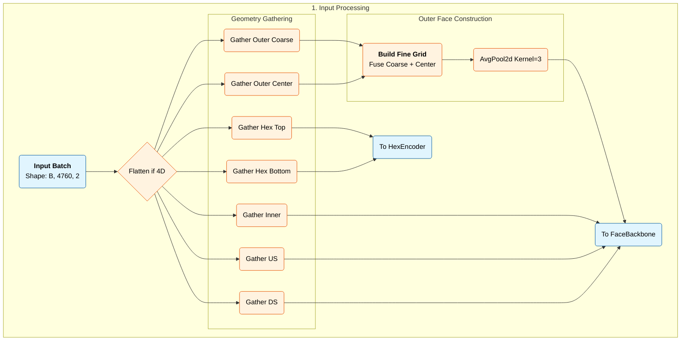

# Model Architecture

The model (`XECEncoder`) utilizes a multi-branch architecture to handle the heterogeneous sensor geometry (SiPMs vs PMTs), followed by an attention-based fusion mechanism.

## A. The Pipeline

```mermaid
graph TD
    %% -- Styles --
    classDef tensor fill:#e1f5fe,stroke:#01579b,stroke-width:1px,color:#000000;
    classDef op fill:#fff3e0,stroke:#e65100,stroke-width:1px,color:#000000;
    classDef block fill:#e8f5e9,stroke:#1b5e20,stroke-width:2px,color:#000000;
    classDef fusion fill:#f3e5f5,stroke:#4a148c,stroke-width:2px,color:#000000;
    classDef param fill:#fff9c4,stroke:#fbc02d,stroke-dasharray: 5 5,color:#000000;

    %% ==========================================
    %% 2. CNN BACKBONE (SHARED)
    %% ==========================================
    subgraph "2. ConvNeXt V2 Path"
        FaceIn(Face Input):::tensor

        %% Stem
        subgraph "Stem"
            StemConv("Conv2d 2->32<br/>k=4, s=1, p=1"):::op
            StemLN(LayerNorm):::op
        end

        %% Stage 1
        subgraph "Stage 1 (Dim=32)"
            CNBlock1("<b>ConvNeXtV2 Block 1</b><br/>DWConv k=7 -> LN -> PWLinear -> GELU -> GRN -> PWLinear"):::block
            CNBlock2("<b>ConvNeXtV2 Block 2</b><br/>DWConv k=7 -> LN -> PWLinear -> GELU -> GRN -> PWLinear"):::block
        end

        %% Downsample
        subgraph "Downsample"
            DS_LN(LayerNorm):::op
            DS_Conv("Conv2d 32->64<br/>k=2, s=2"):::op
        end

        %% Stage 2
        subgraph "Stage 2 (Dim=64)"
            CNBlock3(<b>ConvNeXtV2 Block 1</b>):::block
            CNBlock4(<b>ConvNeXtV2 Block 2</b>):::block
            CNBlock5(<b>ConvNeXtV2 Block 3</b>):::block
        end

        %% Output
        Interp(Interpolate to 4x4):::op
        FlatCNN(Flatten):::op
        FaceOut("<b>Face Token</b><br/>Dim: 1024"):::tensor
    end

    %% ==========================================
    %% 3. HEX ENCODER (SHARED)
    %% ==========================================
    subgraph "3. GraphAttention Path"
        HexIn(Hex Nodes):::tensor

        %% Stem
        subgraph "Hex Stem"
            HexStemLin(Linear 2->96):::op
            HexStemLN(LayerNorm):::op
            HexStemAct(GELU):::op
        end

        %% HexNeXt Stack
        subgraph "HexNeXt Stack (4 Layers)"
            HNBlock1("<b>HexNeXt Block 1</b><br/>HexDepthwise -> LN -> Linear -> GELU -> GRN -> Linear"):::block
            HNBlock2(<b>HexNeXt Block 2</b>):::block
            HNBlock3(<b>HexNeXt Block 3</b>):::block
            HNBlock4(<b>HexNeXt Block 4</b>):::block
        end

        %% Pooling
        HexPool(Global Mean Pool):::op

        %% Projection
        subgraph "Projection"
            HexProjLN(LayerNorm):::op
            HexProjLin(Linear 96->1024):::op
        end

        HexOut("<b>Hex Token</b><br/>Dim: 1024"):::tensor
    end

    %% ==========================================
    %% 4. FUSION & HEAD
    %% ==========================================
    subgraph "4. Fusion & Regression (XECEncoder)"
        TokenStack("<b>Stack Tokens</b><br/>[Inner, US, DS, Outer, Top, Bot]<br/>Shape: (B, 6, 1024)"):::op
        PosEmbed(Add Pos Embed):::op

        subgraph "Transformer Encoder (Dim=1024)"
            TransL1("<b>Layer 1</b><br/>SelfAttn 8-Head -> Add&Norm -> FeedForward 4096 -> Add&Norm"):::fusion
            TransL2("<b>Layer 2</b><br/>SelfAttn 8-Head -> Add&Norm -> FeedForward 4096 -> Add&Norm"):::fusion
        end

        FlatAll("<b>Flatten Sequence</b><br/>Dim: 6 * 1024 = 6144"):::op

        subgraph "Regression Head"
            HeadLin1(Linear 6144 -> 256):::op
            HeadLN(LayerNorm):::op
            HeadGELU(GELU):::op
            HeadDrop(Dropout 0.2):::op
            HeadLin2(Linear 256 -> 2):::op
        end

        FinalOut(("<b>Output</b><br/>Theta, Phi")):::tensor
    end

    %% ==========================================
    %% CONNECTIONS
    %% ==========================================

    %% CNN Flow
    FaceIn --> StemConv --> StemLN --> CNBlock1
    CNBlock1 --> CNBlock2 --> DS_LN --> DS_Conv
    DS_Conv --> CNBlock3 --> CNBlock4 --> CNBlock5
    CNBlock5 --> Interp --> FlatCNN --> FaceOut

    %% Hex Flow
    HexIn --> HexStemLin --> HexStemLN --> HexStemAct
    HexStemAct --> HNBlock1 --> HNBlock2 --> HNBlock3 --> HNBlock4
    HNBlock4 --> HexPool --> HexProjLN --> HexProjLin --> HexOut

    %% Fusion Flow
    FaceOut --> TokenStack
    HexOut --> TokenStack
    TokenStack --> PosEmbed --> TransL1 --> TransL2
    TransL2 --> FlatAll --> HeadLin1 --> HeadLN --> HeadGELU --> HeadDrop --> HeadLin2 --> FinalOut
```




## B. Key Components

### 1. Rectangular Branch: ConvNeXt V2

**Faces**: Inner (93×44), Outer Fine Grid (45×72), Upstream (24×6), Downstream (24×6)

**Architecture**: Uses ConvNeXt V2 blocks with Global Response Normalization (GRN):

```
Input: (B, 2, H, W)  # 2 channels: npho, time
    │
    ▼
┌─────────────┐
│    Stem     │  Conv2d(2→32, k=4) + LayerNorm
└─────────────┘
    │
    ▼
┌─────────────┐
│  Stage 1    │  2× ConvNeXtV2Block (dim=32)
└─────────────┘
    │
    ▼
┌─────────────┐
│ Downsample  │  LayerNorm + Conv2d(32→64, k=2, s=2)
└─────────────┘
    │
    ▼
┌─────────────┐
│  Stage 2    │  3× ConvNeXtV2Block (dim=64)
└─────────────┘
    │
    ▼
┌─────────────┐
│ Adaptive    │  Bilinear interpolation to 4×4
│ Pooling     │
└─────────────┘
    │
    ▼
Output: (B, 1024)  # Flattened: 64 × 4 × 4 = 1024
```

**ConvNeXtV2 Block** (`lib/models/blocks.py:76`):
```
Input x ─────────────────────────────────┐
    │                                    │ (residual)
    ▼                                    │
┌─────────────────┐                      │
│ DWConv 7×7      │  Depthwise spatial   │
└─────────────────┘                      │
    │                                    │
    ▼                                    │
┌─────────────────┐                      │
│ LayerNorm       │                      │
└─────────────────┘                      │
    │                                    │
    ▼                                    │
┌─────────────────┐                      │
│ Linear (→4×dim) │  Expand to 4× width  │
└─────────────────┘                      │
    │                                    │
    ▼                                    │
┌─────────────────┐                      │
│ GELU            │                      │
└─────────────────┘                      │
    │                                    │
    ▼                                    │
┌─────────────────┐                      │
│ GRN             │  Global Response Norm│
└─────────────────┘                      │
    │                                    │
    ▼                                    │
┌─────────────────┐                      │
│ Linear (→dim)   │  Project back        │
└─────────────────┘                      │
    │                                    │
    ▼                                    │
    + ◄──────────────────────────────────┘
    │
Output
```

### 2. Hexagonal Branch: HexNeXt (Graph Convolution)

**Faces**: Top PMT array (334 nodes), Bottom PMT array (334 nodes)

**Problem**: PMTs are arranged in a hexagonal lattice, not a rectangular grid. Standard 2D convolutions don't work here.

**Solution**: Use graph convolution where each PMT is a node, and edges connect neighboring PMTs (6 neighbors per node in the interior).

#### HexDepthwiseConv: The Core Operation

Unlike standard Graph Attention Networks (GAT) which learn attention weights dynamically per input, our `HexDepthwiseConv` uses **learnable position-dependent weights** - more similar to a depthwise convolution kernel adapted for hexagonal grids.

```
Hexagonal neighborhood (each PMT has 6 neighbors):

            [5]   [6]
              \   /
               \ /
          [4]--[0]--[1]
               /\
              /  \
            [3]  [2]

    [0] = center node (self-weight w₀)
    [1-6] = neighbors (position-dependent weights w₁...w₆)

    Weight tensor shape: (1, 7, C)
```

**How it works** (`lib/models/blocks.py:172`):

```python
class HexDepthwiseConv(nn.Module):
    def __init__(self, dim):
        # 7 learnable weights: 1 for center + 6 for neighbors
        self.weight = nn.Parameter(torch.randn(1, 7, dim) * 0.02)
        self.bias = nn.Parameter(torch.zeros(1, 1, dim))

    def forward(self, x, edge_index):
        # x: (B, N, C) - node features
        # edge_index: [src, dst, neighbor_type] - graph structure

        # 1. Gather neighbor features
        neighbor_features = x[:, src, :]  # (B, Edges, C)

        # 2. Apply position-dependent weights
        # neighbor_type ∈ {0,1,2,3,4,5,6} indicates which neighbor position
        w_per_edge = self.weight[0, neighbor_type, :]  # (Edges, C)
        weighted_msgs = neighbor_features * w_per_edge

        # 3. Aggregate weighted messages to destination nodes
        out = scatter_add(weighted_msgs, dst)  # Sum neighbors

        return out + self.bias
```

**Key difference from GAT:**
- **GAT**: Computes attention weights dynamically from input features → O(n²) for dense graphs
- **HexDepthwiseConv**: Uses fixed positional weights learned during training → O(n) operations
- Our approach is more efficient and exploits the regular hexagonal structure

#### HexNeXtBlock: Full Block Structure

The HexNeXtBlock mirrors ConvNeXtV2Block but replaces 2D depthwise conv with graph depthwise conv:

```
Input x ─────────────────────────────────┐
    │                                    │ (residual)
    ▼                                    │
┌─────────────────┐                      │
│ HexDepthwiseConv│  Graph spatial conv  │
└─────────────────┘                      │
    │                                    │
    ▼                                    │
┌─────────────────┐                      │
│ LayerNorm       │                      │
└─────────────────┘                      │
    │                                    │
    ▼                                    │
┌─────────────────┐                      │
│ Linear (→4×dim) │  Expand to 4× width  │
└─────────────────┘                      │
    │                                    │
    ▼                                    │
┌─────────────────┐                      │
│ GELU            │                      │
└─────────────────┘                      │
    │                                    │
    ▼                                    │
┌─────────────────┐                      │
│ GRN             │  Same GRN as Conv    │
└─────────────────┘                      │
    │                                    │
    ▼                                    │
┌─────────────────┐                      │
│ Linear (→dim)   │  Project back        │
└─────────────────┘                      │
    │                                    │
    ▼                                    │
    + ◄──────────────────────────────────┘
    │
Output
```

**Complete DeepHexEncoder** (`lib/models/regressor.py:19`):
```
Input: (B, 334, 2)  # 334 PMT nodes, 2 channels
    │
    ▼
┌─────────────────┐
│ Stem            │  Linear(2→96) + LayerNorm + GELU
└─────────────────┘
    │
    ▼
┌─────────────────┐
│ 4× HexNeXtBlock │  dim=96, with shared edge_index
└─────────────────┘
    │
    ▼
┌─────────────────┐
│ Global Mean Pool│  Average over all 334 nodes
└─────────────────┘
    │
    ▼
┌─────────────────┐
│ Projection      │  LayerNorm + Linear(96→1024)
└─────────────────┘
    │
    ▼
Output: (B, 1024)  # Face token
```

### 3. Global Response Normalization (GRN)

GRN is used in **both** ConvNeXtV2 and HexNeXt blocks. It prevents feature collapse by normalizing based on global feature statistics.

**Formula:**
```
GRN(x) = γ · (x · N(x)) + β + x

where:
  N(x) = ||x||₂ / mean(||x||₂)  # Normalized L2 norm
  γ, β = learnable parameters
```

**Implementation** (`lib/models/blocks.py:43`):
- For **4D tensors** (B, H, W, C): L2 norm over spatial dims (H, W)
- For **3D tensors** (B, N, C): L2 norm over node dim (N)
- Same mathematical operation, different tensor shapes

```python
class GRN(nn.Module):
    def forward(self, x):
        if x.dim() == 3:  # Hex branch: (B, Nodes, C)
            Gx = torch.norm(x, p=2, dim=1, keepdim=True)  # Norm over nodes
        elif x.dim() == 4:  # Conv branch: (B, H, W, C)
            Gx = torch.norm(x, p=2, dim=(1,2), keepdim=True)  # Norm over H,W

        Nx = Gx / (Gx.mean(dim=-1, keepdim=True) + 1e-6)
        return self.gamma * (x * Nx) + self.beta + x
```

### 4. Token Generation: From Features to Tokens

Each branch produces a **1024-dimensional token** representing its face:

```
┌────────────────────────────────────────────────────────────────┐
│                    TOKEN GENERATION                            │
├────────────────────────────────────────────────────────────────┤
│                                                                │
│  RECTANGULAR FACES (via FaceBackbone):                         │
│  ┌─────────────┐    ┌─────────────┐    ┌─────────────┐         │
│  │ Inner       │    │ Conv Stages │    │ Pool to 4×4 │         │
│  │ (93×44×2)   │ →  │ → (H',W',64)│ →  │ → Flatten   │ → 1024  │
│  └─────────────┘    └─────────────┘    └─────────────┘         │
│                                                                │
│  HEXAGONAL FACES (via DeepHexEncoder):                         │
│  ┌─────────────┐    ┌─────────────┐    ┌─────────────┐         │
│  │ Top PMTs    │    │ HexNeXt     │    │ Global Mean │         │
│  │ (334×2)     │ →  │ → (334,96)  │ →  │ + Project   │ → 1024  │
│  └─────────────┘    └─────────────┘    └─────────────┘         │
│                                                                │
└────────────────────────────────────────────────────────────────┘

                              ▼

┌────────────────────────────────────────────────────────────────┐
│                    TOKEN STACKING                              │
├────────────────────────────────────────────────────────────────┤
│                                                                │
│   Face Tokens:        Token 0    Token 1    ...    Token 5     │
│                      ┌──────┐   ┌──────┐         ┌──────┐      │
│                      │Inner │   │  US  │   ...   │Bottom│      │
│                      │1024  │   │ 1024 │         │ 1024 │      │
│                      └──────┘   └──────┘         └──────┘      │
│                          │          │                │         │
│                          ▼          ▼                ▼         │
│                      ┌────────────────────────────────┐        │
│   Stack:             │    (B, 6, 1024)                │        │
│                      └────────────────────────────────┘        │
│                                    │                           │
│   + Positional:                    + pos_embed (1, 6, 1024)    │
│                                    │                           │
│                                    ▼                           │
│                      ┌────────────────────────────────┐        │
│   Transformer:       │ 2-layer TransformerEncoder     │        │
│                      │ 8 heads, FFN=4096              │        │
│                      └────────────────────────────────┘        │
│                                    │                           │
│                                    ▼                           │
│                      ┌────────────────────────────────┐        │
│   Output:            │ (B, 6, 1024) → Flatten → 6144  │        │
│                      └────────────────────────────────┘        │
│                                                                │
└────────────────────────────────────────────────────────────────┘
```

### 5. Mid-Fusion: Transformer Encoder

**Problem**: Physics events (showers) often cross face boundaries. Independent processing misses cross-face correlations.

**Solution**: Treat each face token as a sequence element and use self-attention:

```python
# In XECEncoder.forward_features()
tokens = torch.stack([inner, us, ds, outer, top, bottom], dim=1)  # (B, 6, 1024)
tokens = tokens + self.pos_embed  # Add learnable positional embeddings
tokens = self.fusion_transformer(tokens)  # 2-layer Transformer
```

**Transformer Configuration:**
- **d_model**: 1024 (token dimension)
- **nhead**: 8 (attention heads)
- **dim_feedforward**: 4096 (4× expansion)
- **num_layers**: 2
- **dropout**: 0.1

**Why Transformer over simple concatenation:**
1. Each face can attend to any other face
2. Learns which face correlations matter (via attention weights)
3. Handles variable importance dynamically (e.g., events near corners)

### 6. Task Heads: Multi-Task Regression

The `XECMultiHeadModel` extends the encoder with task-specific regression heads. Each head is an independent MLP that maps the fused 6144-dim representation to task-specific outputs.

**Full Architecture Overview:**

```
┌─────────────────────────────────────────────────────────────────────────────────┐
│                         INPUT PROCESSING                                         │
├─────────────────────────────────────────────────────────────────────────────────┤
│                                                                                 │
│                            Input: (B, 4760, 2)                                  │
│                              ┌─────────────┐                                    │
│                              │ npho, time  │                                    │
│                              │ per sensor  │                                    │
│                              └──────┬──────┘                                    │
│                                     │                                           │
│              ┌──────────────────────┼──────────────────────┐                    │
│              ▼                      ▼                      ▼                    │
│    ┌─────────────────┐    ┌─────────────────┐    ┌─────────────────┐           │
│    │  Rectangular    │    │  Rectangular    │    │   Hexagonal     │           │
│    │  Inner (93×44)  │    │  Outer (15×24)  │    │  Top (334)      │           │
│    │  US (24×6)      │    │                 │    │  Bottom (334)   │           │
│    │  DS (24×6)      │    │                 │    │                 │           │
│    └────────┬────────┘    └────────┬────────┘    └────────┬────────┘           │
│             │                      │                      │                     │
└─────────────┼──────────────────────┼──────────────────────┼─────────────────────┘
              │                      │                      │
┌─────────────┼──────────────────────┼──────────────────────┼─────────────────────┐
│             ▼                      ▼                      ▼                     │
│             │                      │                      │                     │
│         ENCODER                ENCODER                ENCODER                   │
│                                                                                 │
├─────────────────────────────────────────────────────────────────────────────────┤
│                                                                                 │
│    ┌─────────────────┐    ┌─────────────────┐    ┌─────────────────┐           │
│    │  FaceBackbone   │    │  FaceBackbone   │    │ DeepHexEncoder  │           │
│    │  (ConvNeXtV2)   │    │  (ConvNeXtV2)   │    │  (HexNeXt)      │           │
│    │                 │    │                 │    │                 │           │
│    │  Stem→Stage1→   │    │  Stem→Stage1→   │    │  Stem→4×Block   │           │
│    │  Down→Stage2→   │    │  Down→Stage2→   │    │  →Pool→Project  │           │
│    │  Pool(4×4)      │    │  Pool(4×4)      │    │                 │           │
│    └────────┬────────┘    └────────┬────────┘    └────────┬────────┘           │
│             │                      │                      │                     │
│             ▼                      ▼                      ▼                     │
│         (B, 1024)              (B, 1024)              (B, 1024)                 │
│           Inner                  Outer                 Top/Bot                  │
│                                                                                 │
└─────────────────────────────────────────────────────────────────────────────────┘
                                     │
                                     │ 6 face tokens
                                     ▼
┌─────────────────────────────────────────────────────────────────────────────────┐
│                          TRANSFORMER FUSION                                      │
├─────────────────────────────────────────────────────────────────────────────────┤
│                                                                                 │
│                  ┌─────────────────────────────────────┐                        │
│                  │  Stack: (B, 6, 1024)                │                        │
│                  │  [Inner, US, DS, Outer, Top, Bot]   │                        │
│                  └──────────────────┬──────────────────┘                        │
│                                     │                                           │
│                                     │ + Positional Embedding                    │
│                                     ▼                                           │
│                  ┌─────────────────────────────────────┐                        │
│                  │  TransformerEncoder (2 layers)      │                        │
│                  │  • 8 attention heads                │                        │
│                  │  • FFN dim: 4096                    │                        │
│                  │  • Cross-face attention             │                        │
│                  └──────────────────┬──────────────────┘                        │
│                                     │                                           │
│                                     ▼                                           │
│                  ┌─────────────────────────────────────┐                        │
│                  │  Flatten: (B, 6144)                 │                        │
│                  │  6 tokens × 1024 dims               │                        │
│                  └──────────────────┬──────────────────┘                        │
│                                     │                                           │
└─────────────────────────────────────┼───────────────────────────────────────────┘
                                      │
                                      │ Shared representation
                                      ▼
┌─────────────────────────────────────────────────────────────────────────────────┐
│                           TASK HEADS (XECMultiHeadModel)                         │
├─────────────────────────────────────────────────────────────────────────────────┤
│                                                                                 │
│       ┌─────────────┬─────────────┬─────────────┬─────────────┐                │
│       ▼             ▼             ▼             ▼             ▼                │
│  ┌─────────┐   ┌─────────┐   ┌─────────┐   ┌─────────┐   ┌─────────┐          │
│  │ Angle   │   │ Energy  │   │ Timing  │   │ uvwFI   │   │angleVec │          │
│  │  Head   │   │  Head   │   │  Head   │   │  Head   │   │  Head   │          │
│  └────┬────┘   └────┬────┘   └────┬────┘   └────┬────┘   └────┬────┘          │
│       │             │             │             │             │                │
│   Each head is an identical MLP structure:                                     │
│                                                                                 │
│   ┌──────────────────────────────────────────┐                                 │
│   │  Linear(6144 → 256)                      │                                 │
│   │       ↓                                  │                                 │
│   │  LayerNorm(256)                          │                                 │
│   │       ↓                                  │                                 │
│   │  GELU                                    │                                 │
│   │       ↓                                  │                                 │
│   │  Dropout(0.2)                            │                                 │
│   │       ↓                                  │                                 │
│   │  Linear(256 → 256)                       │                                 │
│   │       ↓                                  │                                 │
│   │  LayerNorm(256)                          │                                 │
│   │       ↓                                  │                                 │
│   │  GELU                                    │                                 │
│   │       ↓                                  │                                 │
│   │  Dropout(0.2)                            │                                 │
│   │       ↓                                  │                                 │
│   │  Linear(256 → output_dim)                │                                 │
│   └──────────────────────────────────────────┘                                 │
│       │             │             │             │             │                │
│       ▼             ▼             ▼             ▼             ▼                │
│    (B, 2)        (B, 1)        (B, 1)        (B, 3)        (B, 3)              │
│    θ, φ         Energy        Timing        u, v, w       x, y, z             │
│                                                                                 │
└─────────────────────────────────────────────────────────────────────────────────┘
```

**Task Head Output Dimensions:**

| Task | Output Dim | Description |
|------|------------|-------------|
| `angle` | 2 | Emission angles (θ, φ) |
| `energy` | 1 | Photon energy |
| `timing` | 1 | Event timing |
| `uvwFI` | 3 | First interaction position (u, v, w) |
| `angleVec` | 3 | Emission direction unit vector (x, y, z) |
| `n_gamma` | 5 | Gamma multiplicity classification (0-4) |

**Key Design Points:**

1. **Shared Encoder**: All tasks share the same encoder and transformer fusion, enabling transfer learning across related physical observables.

2. **Independent Heads**: Each task has its own head, allowing task-specific optimization without interference.

3. **Consistent Head Architecture**: All heads use the same 2-hidden-layer MLP structure (6144→256→256→output), only differing in final output dimension.

4. **Selective Training**: Tasks can be enabled/disabled in config without changing the architecture.

**Implementation** (`lib/models/regressor.py`):

```python
class XECMultiHeadModel(nn.Module):
    def __init__(self, encoder, task_config, ...):
        self.encoder = encoder  # Shared backbone

        # Create task-specific heads
        self.heads = nn.ModuleDict()
        for task_name, task_cfg in task_config.items():
            if task_cfg.enabled:
                self.heads[task_name] = self._make_head(
                    input_dim=6144,
                    output_dim=TASK_OUTPUT_DIMS[task_name]
                )

    def forward(self, x, adj_matrices):
        # Shared encoder forward
        features = self.encoder.forward_features(x, adj_matrices)  # (B, 6144)

        # Task-specific predictions
        outputs = {}
        for task_name, head in self.heads.items():
            outputs[task_name] = head(features)

        return outputs
```

### 7. Network Depth Summary

This section summarizes the total number of layers in the architecture, confirming it qualifies as **deep learning** (typically defined as neural networks with 3+ hidden layers).

#### Layer Count by Component

**Rectangular Face Path (FaceBackbone):**

| Component | Layers | Details |
|-----------|--------|---------|
| Stem | 1 Conv | Conv2d(2→32, k=4) |
| Stage 1 | 2 blocks | 2× ConvNeXtV2Block (1 dwconv + 2 linear each) |
| Downsample | 1 Conv | Conv2d(32→64, k=2, s=2) |
| Stage 2 | 3 blocks | 3× ConvNeXtV2Block (1 dwconv + 2 linear each) |
| **Subtotal** | **~17 layers** | 7 conv + 10 linear |

**Hexagonal Face Path (DeepHexEncoder):**

| Component | Layers | Details |
|-----------|--------|---------|
| Stem | 1 Linear | Linear(2→96) |
| HexNeXt Stack | 4 blocks | 4× HexNeXtBlock (2 linear in HexDepthwise + 2 linear each) |
| Projection | 1 Linear | Linear(96→1024) |
| **Subtotal** | **~18 layers** | 18 linear |

**Transformer Fusion:**

| Component | Layers | Details |
|-----------|--------|---------|
| TransformerEncoder | 2 layers | Each: Multi-head attention + FFN (2 linear) |
| **Subtotal** | **~6 layers** | 2 attention + 4 linear |

**Regression Head:**

| Component | Layers | Details |
|-----------|--------|---------|
| MLP | 2 Linear | Linear(6144→256→output) |

#### Understanding the Transformer Configuration

The transformer uses **self-attention** (not cross-attention):

- **6 tokens**: The face representations [inner, us, ds, outer, top, bot]
- **8 heads**: Parallel attention mechanisms within each layer (splits 1024 dim into 8×128)
- **FFN**: Feed-Forward Network (the MLP inside each transformer layer): Linear(1024→4096) → GELU → Linear(4096→1024)

Each token attends to all 6 tokens (including itself), enabling cross-face communication:

```
        inner  outer  us   ds   top   bot
inner   [✓      ✓     ✓    ✓    ✓     ✓ ]  ← inner attends to all
outer   [✓      ✓     ✓    ✓    ✓     ✓ ]  ← outer attends to all
us      [✓      ✓     ✓    ✓    ✓     ✓ ]
ds      [✓      ✓     ✓    ✓    ✓     ✓ ]
top     [✓      ✓     ✓    ✓    ✓     ✓ ]
bot     [✓      ✓     ✓    ✓    ✓     ✓ ]
```

#### Total Network Depth

| Path | Total Layers |
|------|--------------|
| Rectangular face → Transformer → Head | 17 + 6 + 2 = **~25 layers** |
| Hexagonal face → Transformer → Head | 18 + 6 + 2 = **~26 layers** |

With ~25-26 layers from input to output, this architecture clearly qualifies as **deep learning**. The threshold for "deep" is typically considered 3+ hidden layers.

#### Design Notes

- **Similar depth across paths**: Rectangular (~17) and hexagonal (~18) paths have comparable depth, ensuring balanced feature extraction before fusion.
- **Simple regression head**: Only 2 linear layers in the head is sufficient because the encoder does the heavy lifting. The head simply maps the fused 6144-dim features to the output dimension.
- **8 heads vs 6 tokens**: Having more attention heads than tokens is acceptable. Each head (128-dim) can learn different relationship patterns among the 6 faces. With only 6 tokens, using 4-8 heads would all perform similarly.

---

## C. HexNeXt: Comparison with Related Work

The HexNeXt architecture combines ideas from modern CNNs (ConvNeXt V2) with graph neural networks, creating a novel approach for hexagonal lattice data.

### Design Philosophy

HexNeXt uses **direction-aware depthwise convolution on graphs**:

```python
# Core operation: 7 learnable weights (center + 6 hex directions)
self.weight = nn.Parameter(torch.randn(1, 7, dim))

# Forward: weight lookup by neighbor type, then aggregate
w_per_edge = self.weight[0, neighbor_type, :]  # Select by direction
weighted_msgs = neighbor_features * w_per_edge
out = scatter_add(weighted_msgs, dst)
```

### Comparison with Existing Methods

| Method | Year | Approach | Key Difference from HexNeXt |
|--------|------|----------|----------------------------|
| **GCN** | 2017 | Isotropic aggregation | Same weight for all neighbors; HexNeXt is anisotropic |
| **GAT** | 2018 | Dynamic attention weights | Computes weights from features; HexNeXt uses fixed positional weights |
| **MoNet** | 2017 | Gaussian mixture on pseudo-coords | Continuous weights; HexNeXt uses discrete neighbor types |
| **RGCN** | 2018 | Per-relation weight matrices | Full matrices per type; HexNeXt uses depthwise vectors |

### Detailed Comparisons

#### vs. MoNet (Monti et al., CVPR 2017) — **Most Similar**

MoNet generalizes CNNs to non-Euclidean domains using learnable Gaussian mixture models:

```
MoNet:    w(u) = exp(-½(u-μ)ᵀΣ⁻¹(u-μ))  # Gaussian on pseudo-coordinates
HexNeXt:  w[type] = learnable_vector    # Direct lookup by neighbor type
```

| Aspect | MoNet | HexNeXt |
|--------|-------|---------|
| Neighbor weighting | Continuous (Gaussian) | Discrete (7 types) |
| Parameters | μ, Σ per kernel | Vector per type |
| Flexibility | Any geometry | Hexagonal lattice |
| Complexity | GMM computation | Direct lookup |

**Why HexNeXt is simpler:** We exploit the known hexagonal structure (exactly 6 neighbors in fixed positions), avoiding the overhead of Gaussian mixture computation.

#### vs. GAT (Veličković et al., ICLR 2018)

GAT computes attention weights dynamically from node features:

```
GAT:      αᵢⱼ = softmax(LeakyReLU(aᵀ[Whᵢ || Whⱼ]))
HexNeXt:  wᵢⱼ = weight[neighbor_type(i,j)]
```

| Aspect | GAT | HexNeXt |
|--------|-----|---------|
| Edge weights | Dynamic (content-dependent) | Static (position-dependent) |
| Computation | O(E) attention per layer | O(1) weight lookup |
| Adaptability | Can adapt to input | Fixed spatial pattern |

**Trade-off:** GAT is more flexible but slower. HexNeXt is faster and sufficient when spatial position is the primary distinguishing factor (as in our detector).

#### vs. RGCN (Schlichtkrull et al., 2018)

RGCN uses different weight matrices for different edge types:

```
RGCN:     hᵢ' = σ(Σᵣ Σⱼ (1/cᵢ,ᵣ) Wᵣ hⱼ)  # Full matrix Wᵣ per relation
HexNeXt:  hᵢ' = Σⱼ wₜ ⊙ hⱼ              # Depthwise vector wₜ per type
```

| Aspect | RGCN | HexNeXt |
|--------|------|---------|
| Edge types | Semantic relations | Spatial directions |
| Weights per type | Full matrix W | Depthwise vector |
| Parameters | O(d² × R) | O(d × 7) |

**Parameter efficiency:** HexNeXt uses depthwise (element-wise) weights instead of full matrices, dramatically reducing parameters.

### Novel Contributions of HexNeXt

1. **ConvNeXt V2 block design on graphs** — First adaptation of the modern ConvNeXt V2 pattern (depthwise → norm → inverted bottleneck → GRN → residual) to graph neural networks.

2. **Discrete direction encoding** — Exploits fixed hexagonal geometry with 7 discrete neighbor types instead of continuous pseudo-coordinates.

3. **Depthwise separable on graphs** — Separates spatial aggregation (HexDepthwiseConv) from channel mixing (MLP), matching the efficiency gains seen in MobileNet/ConvNeXt.

4. **Shared GRN across modalities** — Same Global Response Normalization works for both 2D convolutions and graph convolutions.

### Summary: Feature Comparison

| Feature | GCN | GAT | MoNet | RGCN | **HexNeXt** |
|---------|-----|-----|-------|------|-------------|
| Anisotropic | ❌ | ✅ | ✅ | ✅ | ✅ |
| Direction-aware | ❌ | ❌ | ✅ | ✅ | ✅ |
| Learnable spatial weights | ❌ | Dynamic | Gaussian | Matrix | **Depthwise** |
| Depthwise separable | ❌ | ❌ | ❌ | ❌ | ✅ |
| GRN normalization | ❌ | ❌ | ❌ | ❌ | ✅ |
| Inverted bottleneck (4×) | ❌ | ❌ | ❌ | ❌ | ✅ |

### References

- **GCN**: Kipf & Welling, ["Semi-Supervised Classification with Graph Convolutional Networks"](https://arxiv.org/abs/1609.02907), ICLR 2017
- **GAT**: Veličković et al., ["Graph Attention Networks"](https://arxiv.org/abs/1710.10903), ICLR 2018
- **MoNet**: Monti et al., ["Geometric deep learning on graphs and manifolds using mixture model CNNs"](https://arxiv.org/abs/1611.08402), CVPR 2017
- **RGCN**: Schlichtkrull et al., ["Modeling Relational Data with Graph Convolutional Networks"](https://arxiv.org/abs/1703.06103), ESWC 2018
- **ConvNeXt V2**: Woo et al., ["ConvNeXt V2: Co-designing and Scaling ConvNets with Masked Autoencoders"](https://arxiv.org/abs/2301.00808), CVPR 2023
- **Distill GNN Tutorial**: [Understanding Convolutions on Graphs](https://distill.pub/2021/understanding-gnns/)
